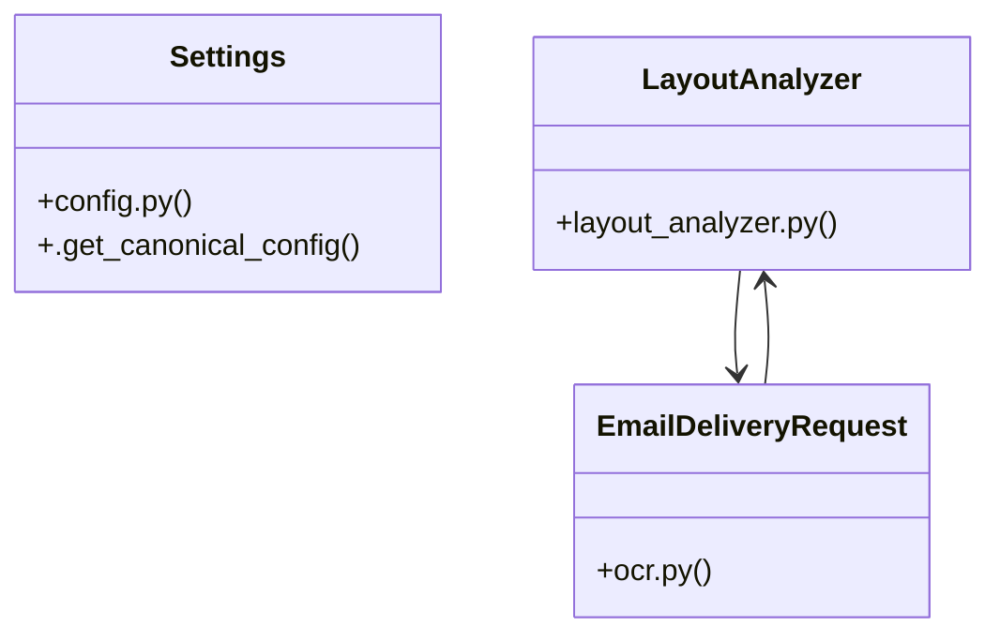

# Community 0

> 53 nodes · cohesion 0.06

## Key Concepts

- [get_redis_client()](file:///E:/Non_Office/Dev_Space/vibe_skool/freeOcr/src/backend/app/redis_client.py#L9) (15 connections)
- [load_canonical_config()](file:///E:/Non_Office/Dev_Space/vibe_skool/freeOcr/src/backend/app/config.py#L10) (9 connections)
- [redis_client.py](file:///E:/Non_Office/Dev_Space/vibe_skool/freeOcr/src/backend/app/redis_client.py#L1) (8 connections)
- [convert_document()](file:///E:/Non_Office/Dev_Space/vibe_skool/freeOcr/src/backend/app/api/v1/endpoints/ocr.py#L140) (8 connections)
- [ocr.py](file:///E:/Non_Office/Dev_Space/vibe_skool/freeOcr/src/backend/app/api/v1/endpoints/ocr.py#L1) (7 connections)
- [rewarded_ad_callback()](file:///E:/Non_Office/Dev_Space/vibe_skool/freeOcr/src/backend/app/api/v1/endpoints/ocr.py#L301) (7 connections)
- [LayoutAnalyzer](file:///E:/Non_Office/Dev_Space/vibe_skool/freeOcr/src/backend/app/services/layout_analyzer.py#L12) (6 connections)
- [main.py](file:///E:/Non_Office/Dev_Space/vibe_skool/freeOcr/src/backend/app/main.py#L1) (5 connections)
- [email_download_links()](file:///E:/Non_Office/Dev_Space/vibe_skool/freeOcr/src/backend/app/api/v1/endpoints/ocr.py#L48) (5 connections)
- [check_redis_connection()](file:///E:/Non_Office/Dev_Space/vibe_skool/freeOcr/src/backend/app/redis_client.py#L13) (5 connections)
- [get_ad_pass_metadata()](file:///E:/Non_Office/Dev_Space/vibe_skool/freeOcr/src/backend/app/redis_client.py#L62) (5 connections)
- [config.py](file:///E:/Non_Office/Dev_Space/vibe_skool/freeOcr/src/backend/app/config.py#L1) (4 connections)
- [database.py](file:///E:/Non_Office/Dev_Space/vibe_skool/freeOcr/src/backend/app/database.py#L1) (4 connections)
- [healthz()](file:///E:/Non_Office/Dev_Space/vibe_skool/freeOcr/src/backend/app/main.py#L38) (4 connections)
- [_get_session_keys()](file:///E:/Non_Office/Dev_Space/vibe_skool/freeOcr/src/backend/app/api/v1/endpoints/ocr.py#L37) (4 connections)
- [store_ad_pass_metadata()](file:///E:/Non_Office/Dev_Space/vibe_skool/freeOcr/src/backend/app/redis_client.py#L49) (4 connections)
- [get_runtime_config()](file:///E:/Non_Office/Dev_Space/vibe_skool/freeOcr/src/backend/app/api/v1/endpoints/config.py#L9) (3 connections)
- [Settings](file:///E:/Non_Office/Dev_Space/vibe_skool/freeOcr/src/backend/app/config.py#L40) (3 connections)
- [test_config_and_quotas.py](file:///E:/Non_Office/Dev_Space/vibe_skool/freeOcr/src/tests/test_config_and_quotas.py#L1) (3 connections)
- [test_redis.py](file:///E:/Non_Office/Dev_Space/vibe_skool/freeOcr/src/tests/test_redis.py#L1) (3 connections)
- [EmailDeliveryRequest](file:///E:/Non_Office/Dev_Space/vibe_skool/freeOcr/src/backend/app/api/v1/endpoints/ocr.py#L21) (3 connections)
- [_get_normalized_client_ip()](file:///E:/Non_Office/Dev_Space/vibe_skool/freeOcr/src/backend/app/api/v1/endpoints/ocr.py#L26) (3 connections)
- [get_job_metadata()](file:///E:/Non_Office/Dev_Space/vibe_skool/freeOcr/src/backend/app/redis_client.py#L35) (3 connections)
- [store_job_metadata()](file:///E:/Non_Office/Dev_Space/vibe_skool/freeOcr/src/backend/app/redis_client.py#L21) (3 connections)
- [test_check_redis_connection_mocked_failure()](file:///E:/Non_Office/Dev_Space/vibe_skool/freeOcr/src/tests/test_redis.py#L26) (3 connections)
- *... and 28 more nodes in this community*

## Class Diagram

## Relationships

- No strong cross-community connections detected

## Source Files

- [E:\Non_Office\Dev_Space\vibe_skool\freeOcr\src\backend\app\api\v1\endpoints\config.py](file:///E:/Non_Office/Dev_Space/vibe_skool/freeOcr/src/backend/app/api/v1/endpoints/config.py)
- [E:\Non_Office\Dev_Space\vibe_skool\freeOcr\src\backend\app\api\v1\endpoints\ocr.py](file:///E:/Non_Office/Dev_Space/vibe_skool/freeOcr/src/backend/app/api/v1/endpoints/ocr.py)
- [E:\Non_Office\Dev_Space\vibe_skool\freeOcr\src\backend\app\api\v1\router.py](file:///E:/Non_Office/Dev_Space/vibe_skool/freeOcr/src/backend/app/api/v1/router.py)
- [E:\Non_Office\Dev_Space\vibe_skool\freeOcr\src\backend\app\config.py](file:///E:/Non_Office/Dev_Space/vibe_skool/freeOcr/src/backend/app/config.py)
- [E:\Non_Office\Dev_Space\vibe_skool\freeOcr\src\backend\app\database.py](file:///E:/Non_Office/Dev_Space/vibe_skool/freeOcr/src/backend/app/database.py)
- [E:\Non_Office\Dev_Space\vibe_skool\freeOcr\src\backend\app\main.py](file:///E:/Non_Office/Dev_Space/vibe_skool/freeOcr/src/backend/app/main.py)
- [E:\Non_Office\Dev_Space\vibe_skool\freeOcr\src\backend\app\redis_client.py](file:///E:/Non_Office/Dev_Space/vibe_skool/freeOcr/src/backend/app/redis_client.py)
- [E:\Non_Office\Dev_Space\vibe_skool\freeOcr\src\backend\app\services\layout_analyzer.py](file:///E:/Non_Office/Dev_Space/vibe_skool/freeOcr/src/backend/app/services/layout_analyzer.py)
- [E:\Non_Office\Dev_Space\vibe_skool\freeOcr\src\tests\test_config_and_quotas.py](file:///E:/Non_Office/Dev_Space/vibe_skool/freeOcr/src/tests/test_config_and_quotas.py)
- [E:\Non_Office\Dev_Space\vibe_skool\freeOcr\src\tests\test_redis.py](file:///E:/Non_Office/Dev_Space/vibe_skool/freeOcr/src/tests/test_redis.py)

## Audit Trail

- EXTRACTED: 118 (71%)
- INFERRED: 49 (29%)
- AMBIGUOUS: 0 (0%)

---

*Part of the graphify knowledge wiki. See [[index]] to navigate.*