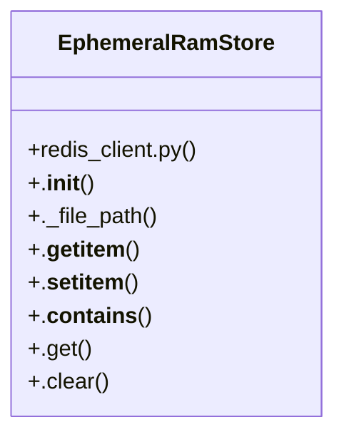

# Community 0

> 108 nodes · cohesion 0.03

## Key Concepts

- [.get()](file:///E:/Non_Office/Dev_Space/vibe_skool/freeOcr/src/backend/app/redis_client.py#L65) (67 connections)
- [get_redis_client()](file:///E:/Non_Office/Dev_Space/vibe_skool/freeOcr/src/backend/app/redis_client.py#L89) (20 connections)
- [EphemeralRamStore](file:///E:/Non_Office/Dev_Space/vibe_skool/freeOcr/src/backend/app/redis_client.py#L9) (18 connections)
- [compose_searchable_pdf()](file:///E:/Non_Office/Dev_Space/vibe_skool/freeOcr/src/backend/app/services/pdf_composer.py#L12) (11 connections)
- [get_searchable_pdf()](file:///E:/Non_Office/Dev_Space/vibe_skool/freeOcr/src/backend/app/services/pdf_composer.py#L115) (10 connections)
- [redis_client.py](file:///E:/Non_Office/Dev_Space/vibe_skool/freeOcr/src/backend/app/redis_client.py#L1) (9 connections)
- [test_download_endpoints.py](file:///E:/Non_Office/Dev_Space/vibe_skool/freeOcr/src/tests/test_download_endpoints.py#L1) (9 connections)
- [test_pdf_composer.py](file:///E:/Non_Office/Dev_Space/vibe_skool/freeOcr/src/tests/test_pdf_composer.py#L1) (8 connections)
- [jobs.py](file:///E:/Non_Office/Dev_Space/vibe_skool/freeOcr/src/backend/app/api/v1/endpoints/jobs.py#L1) (6 connections)
- [get_ad_pass_metadata()](file:///E:/Non_Office/Dev_Space/vibe_skool/freeOcr/src/backend/app/redis_client.py#L142) (6 connections)
- [test_job_page_image.py](file:///E:/Non_Office/Dev_Space/vibe_skool/freeOcr/src/tests/test_job_page_image.py#L1) (5 connections)
- [batch_download_zip()](file:///E:/Non_Office/Dev_Space/vibe_skool/freeOcr/src/backend/app/api/v1/endpoints/jobs.py#L344) (5 connections)
- [download_job_file()](file:///E:/Non_Office/Dev_Space/vibe_skool/freeOcr/src/backend/app/api/v1/endpoints/jobs.py#L456) (5 connections)
- [get_job_page_image()](file:///E:/Non_Office/Dev_Space/vibe_skool/freeOcr/src/backend/app/api/v1/endpoints/jobs.py#L227) (5 connections)
- [check_redis_connection()](file:///E:/Non_Office/Dev_Space/vibe_skool/freeOcr/src/backend/app/redis_client.py#L93) (5 connections)
- [._file_path()](file:///E:/Non_Office/Dev_Space/vibe_skool/freeOcr/src/backend/app/redis_client.py#L20) (5 connections)
- [_create_sample_pdf_bytes()](file:///E:/Non_Office/Dev_Space/vibe_skool/freeOcr/src/tests/test_pdf_composer.py#L9) (5 connections)
- [test_health.py](file:///E:/Non_Office/Dev_Space/vibe_skool/freeOcr/src/tests/test_health.py#L1) (4 connections)
- [test_ocr_sse.py](file:///E:/Non_Office/Dev_Space/vibe_skool/freeOcr/src/tests/test_ocr_sse.py#L1) (4 connections)
- [get_job_preview()](file:///E:/Non_Office/Dev_Space/vibe_skool/freeOcr/src/backend/app/api/v1/endpoints/jobs.py#L179) (4 connections)
- [get_job_status()](file:///E:/Non_Office/Dev_Space/vibe_skool/freeOcr/src/backend/app/api/v1/endpoints/jobs.py#L22) (4 connections)
- [stream_job_events()](file:///E:/Non_Office/Dev_Space/vibe_skool/freeOcr/src/backend/app/api/v1/endpoints/jobs.py#L56) (4 connections)
- [.__getitem__()](file:///E:/Non_Office/Dev_Space/vibe_skool/freeOcr/src/backend/app/redis_client.py#L25) (4 connections)
- [get_job_metadata()](file:///E:/Non_Office/Dev_Space/vibe_skool/freeOcr/src/backend/app/redis_client.py#L115) (4 connections)
- [store_ad_pass_metadata()](file:///E:/Non_Office/Dev_Space/vibe_skool/freeOcr/src/backend/app/redis_client.py#L129) (4 connections)
- *... and 83 more nodes in this community*

## Class Diagram

## Relationships

- [[Community 2]] (5 shared connections)
- [[Community 15]] (5 shared connections)
- [[Community 17]] (4 shared connections)
- [[Community 20]] (3 shared connections)
- [[Community 26]] (2 shared connections)

## Source Files

- [E:\Non_Office\Dev_Space\vibe_skool\freeOcr\src\backend\app\api\v1\endpoints\jobs.py](file:///E:/Non_Office/Dev_Space/vibe_skool/freeOcr/src/backend/app/api/v1/endpoints/jobs.py)
- [E:\Non_Office\Dev_Space\vibe_skool\freeOcr\src\backend\app\redis_client.py](file:///E:/Non_Office/Dev_Space/vibe_skool/freeOcr/src/backend/app/redis_client.py)
- [E:\Non_Office\Dev_Space\vibe_skool\freeOcr\src\backend\app\services\pdf_composer.py](file:///E:/Non_Office/Dev_Space/vibe_skool/freeOcr/src/backend/app/services/pdf_composer.py)
- [E:\Non_Office\Dev_Space\vibe_skool\freeOcr\src\tests\test_complex_pdf_reconstruction.py](file:///E:/Non_Office/Dev_Space/vibe_skool/freeOcr/src/tests/test_complex_pdf_reconstruction.py)
- [E:\Non_Office\Dev_Space\vibe_skool\freeOcr\src\tests\test_download_endpoints.py](file:///E:/Non_Office/Dev_Space/vibe_skool/freeOcr/src/tests/test_download_endpoints.py)
- [E:\Non_Office\Dev_Space\vibe_skool\freeOcr\src\tests\test_health.py](file:///E:/Non_Office/Dev_Space/vibe_skool/freeOcr/src/tests/test_health.py)
- [E:\Non_Office\Dev_Space\vibe_skool\freeOcr\src\tests\test_job_page_image.py](file:///E:/Non_Office/Dev_Space/vibe_skool/freeOcr/src/tests/test_job_page_image.py)
- [E:\Non_Office\Dev_Space\vibe_skool\freeOcr\src\tests\test_ocr_preview.py](file:///E:/Non_Office/Dev_Space/vibe_skool/freeOcr/src/tests/test_ocr_preview.py)
- [E:\Non_Office\Dev_Space\vibe_skool\freeOcr\src\tests\test_ocr_sse.py](file:///E:/Non_Office/Dev_Space/vibe_skool/freeOcr/src/tests/test_ocr_sse.py)
- [E:\Non_Office\Dev_Space\vibe_skool\freeOcr\src\tests\test_pdf_composer.py](file:///E:/Non_Office/Dev_Space/vibe_skool/freeOcr/src/tests/test_pdf_composer.py)
- [E:\Non_Office\Dev_Space\vibe_skool\freeOcr\src\tests\test_redis.py](file:///E:/Non_Office/Dev_Space/vibe_skool/freeOcr/src/tests/test_redis.py)
- [E:\Non_Office\Dev_Space\vibe_skool\freeOcr\src\tests\test_sse_events.py](file:///E:/Non_Office/Dev_Space/vibe_skool/freeOcr/src/tests/test_sse_events.py)

## Audit Trail

- EXTRACTED: 238 (58%)
- INFERRED: 172 (42%)
- AMBIGUOUS: 0 (0%)

---

*Part of the graphify knowledge wiki. See [[index]] to navigate.*