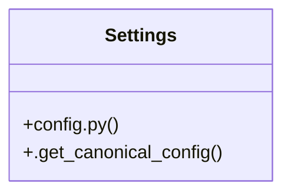

# Community 3

> 64 nodes · cohesion 0.03

## Key Concepts

- [split_preview_viewer.dart](file:///E:/Non_Office/Dev_Space/vibe_skool/freeOcr/src/frontend/lib/widgets/split_preview_viewer.dart) (53 connections)
- [check_database_connection()](file:///E:/Non_Office/Dev_Space/vibe_skool/freeOcr/src/backend/app/database.py#L22) (5 connections)
- [main.py](file:///E:/Non_Office/Dev_Space/vibe_skool/freeOcr/src/backend/app/main.py#L1) (5 connections)
- [config.py](file:///E:/Non_Office/Dev_Space/vibe_skool/freeOcr/src/backend/app/config.py#L1) (4 connections)
- [database.py](file:///E:/Non_Office/Dev_Space/vibe_skool/freeOcr/src/backend/app/database.py#L1) (4 connections)
- [healthz()](file:///E:/Non_Office/Dev_Space/vibe_skool/freeOcr/src/backend/app/main.py#L39) (4 connections)
- [Settings](file:///E:/Non_Office/Dev_Space/vibe_skool/freeOcr/src/backend/app/config.py#L40) (3 connections)
- [test_database_connection()](file:///E:/Non_Office/Dev_Space/vibe_skool/freeOcr/src/tests/test_database.py#L11) (3 connections)
- [test_database_metadata_create_all()](file:///E:/Non_Office/Dev_Space/vibe_skool/freeOcr/src/tests/test_database.py#L16) (3 connections)
- [.get_canonical_config()](file:///E:/Non_Office/Dev_Space/vibe_skool/freeOcr/src/backend/app/config.py#L53) (2 connections)
- [Text](file:///E:/Non_Office/Dev_Space/vibe_skool/freeOcr/src/frontend/lib/widgets/split_preview_viewer.dart) (2 connections)
- [test_database.py](file:///E:/Non_Office/Dev_Space/vibe_skool/freeOcr/src/tests/test_database.py#L1) (2 connections)
- [health_check()](file:///E:/Non_Office/Dev_Space/vibe_skool/freeOcr/src/backend/app/main.py#L27) (2 connections)
- **BaseSettings** (1 connections)
- [get_db()](file:///E:/Non_Office/Dev_Space/vibe_skool/freeOcr/src/backend/app/database.py#L14) (1 connections)
- [router.py](file:///E:/Non_Office/Dev_Space/vibe_skool/freeOcr/src/backend/app/api/v1/router.py#L1) (1 connections)
- [AlertDialog](file:///E:/Non_Office/Dev_Space/vibe_skool/freeOcr/src/frontend/lib/widgets/split_preview_viewer.dart) (1 connections)
- [BackdropFilter](file:///E:/Non_Office/Dev_Space/vibe_skool/freeOcr/src/frontend/lib/widgets/split_preview_viewer.dart) (1 connections)
- [build](file:///E:/Non_Office/Dev_Space/vibe_skool/freeOcr/src/frontend/lib/widgets/split_preview_viewer.dart) (1 connections)
- [_buildDocumentPreviewPane](file:///E:/Non_Office/Dev_Space/vibe_skool/freeOcr/src/frontend/lib/widgets/split_preview_viewer.dart) (1 connections)
- [_buildMobileBody](file:///E:/Non_Office/Dev_Space/vibe_skool/freeOcr/src/frontend/lib/widgets/split_preview_viewer.dart) (1 connections)
- [_buildMobileHeader](file:///E:/Non_Office/Dev_Space/vibe_skool/freeOcr/src/frontend/lib/widgets/split_preview_viewer.dart) (1 connections)
- [_buildRightTextPane](file:///E:/Non_Office/Dev_Space/vibe_skool/freeOcr/src/frontend/lib/widgets/split_preview_viewer.dart) (1 connections)
- [_buildSplitView](file:///E:/Non_Office/Dev_Space/vibe_skool/freeOcr/src/frontend/lib/widgets/split_preview_viewer.dart) (1 connections)
- [_buildStackedView](file:///E:/Non_Office/Dev_Space/vibe_skool/freeOcr/src/frontend/lib/widgets/split_preview_viewer.dart) (1 connections)
- *... and 39 more nodes in this community*

## Class Diagram

## Relationships

- No strong cross-community connections detected

## Source Files

- [E:\Non_Office\Dev_Space\vibe_skool\freeOcr\src\backend\app\api\v1\router.py](file:///E:/Non_Office/Dev_Space/vibe_skool/freeOcr/src/backend/app/api/v1/router.py)
- [E:\Non_Office\Dev_Space\vibe_skool\freeOcr\src\backend\app\config.py](file:///E:/Non_Office/Dev_Space/vibe_skool/freeOcr/src/backend/app/config.py)
- [E:\Non_Office\Dev_Space\vibe_skool\freeOcr\src\backend\app\database.py](file:///E:/Non_Office/Dev_Space/vibe_skool/freeOcr/src/backend/app/database.py)
- [E:\Non_Office\Dev_Space\vibe_skool\freeOcr\src\backend\app\main.py](file:///E:/Non_Office/Dev_Space/vibe_skool/freeOcr/src/backend/app/main.py)
- [E:\Non_Office\Dev_Space\vibe_skool\freeOcr\src\frontend\lib\widgets\split_preview_viewer.dart](file:///E:/Non_Office/Dev_Space/vibe_skool/freeOcr/src/frontend/lib/widgets/split_preview_viewer.dart)
- [E:\Non_Office\Dev_Space\vibe_skool\freeOcr\src\tests\test_database.py](file:///E:/Non_Office/Dev_Space/vibe_skool/freeOcr/src/tests/test_database.py)

## Audit Trail

- EXTRACTED: 134 (94%)
- INFERRED: 9 (6%)
- AMBIGUOUS: 0 (0%)

---

*Part of the graphify knowledge wiki. See [[index]] to navigate.*