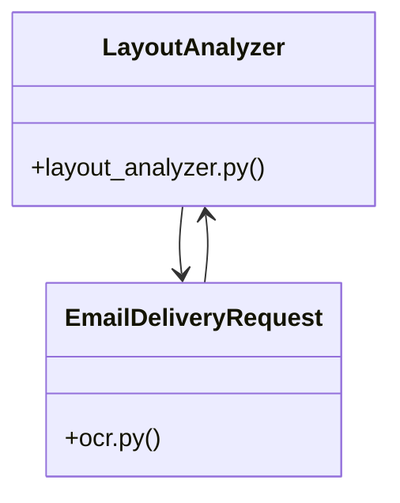

# Community 5

> 43 nodes · cohesion 0.06

## Key Concepts

- [load_canonical_config()](file:///E:/Non_Office/Dev_Space/vibe_skool/freeOcr/src/backend/app/config.py#L10) (9 connections)
- [convert_document()](file:///E:/Non_Office/Dev_Space/vibe_skool/freeOcr/src/backend/app/api/v1/endpoints/ocr.py#L140) (9 connections)
- [rewarded_ad_callback()](file:///E:/Non_Office/Dev_Space/vibe_skool/freeOcr/src/backend/app/api/v1/endpoints/ocr.py#L301) (8 connections)
- [ocr.py](file:///E:/Non_Office/Dev_Space/vibe_skool/freeOcr/src/backend/app/api/v1/endpoints/ocr.py#L1) (7 connections)
- [analyze_pdf_bytes()](file:///E:/Non_Office/Dev_Space/vibe_skool/freeOcr/src/backend/app/services/layout_analyzer.py#L14) (7 connections)
- [LayoutAnalyzer](file:///E:/Non_Office/Dev_Space/vibe_skool/freeOcr/src/backend/app/services/layout_analyzer.py#L12) (6 connections)
- [test_layout_analyzer.py](file:///E:/Non_Office/Dev_Space/vibe_skool/freeOcr/src/tests/test_layout_analyzer.py#L1) (5 connections)
- [_get_session_keys()](file:///E:/Non_Office/Dev_Space/vibe_skool/freeOcr/src/backend/app/api/v1/endpoints/ocr.py#L37) (5 connections)
- [_get_normalized_client_ip()](file:///E:/Non_Office/Dev_Space/vibe_skool/freeOcr/src/backend/app/api/v1/endpoints/ocr.py#L26) (4 connections)
- [get_runtime_config()](file:///E:/Non_Office/Dev_Space/vibe_skool/freeOcr/src/backend/app/api/v1/endpoints/config.py#L9) (3 connections)
- [layout_analyzer.py](file:///E:/Non_Office/Dev_Space/vibe_skool/freeOcr/src/backend/app/services/layout_analyzer.py#L1) (3 connections)
- [test_adsense_config.py](file:///E:/Non_Office/Dev_Space/vibe_skool/freeOcr/src/tests/test_adsense_config.py#L1) (3 connections)
- [test_config_and_quotas.py](file:///E:/Non_Office/Dev_Space/vibe_skool/freeOcr/src/tests/test_config_and_quotas.py#L1) (3 connections)
- [test_limit_evaluator.py](file:///E:/Non_Office/Dev_Space/vibe_skool/freeOcr/src/tests/test_limit_evaluator.py#L1) (3 connections)
- [EmailDeliveryRequest](file:///E:/Non_Office/Dev_Space/vibe_skool/freeOcr/src/backend/app/api/v1/endpoints/ocr.py#L21) (3 connections)
- [test_adsense_config_api_endpoint()](file:///E:/Non_Office/Dev_Space/vibe_skool/freeOcr/src/tests/test_adsense_config.py#L20) (3 connections)
- [test_adsense_config_interval_loaded()](file:///E:/Non_Office/Dev_Space/vibe_skool/freeOcr/src/tests/test_adsense_config.py#L10) (3 connections)
- [test_dynamic_config_file_reload()](file:///E:/Non_Office/Dev_Space/vibe_skool/freeOcr/src/tests/test_adsense_config.py#L31) (3 connections)
- [create_sample_pdf()](file:///E:/Non_Office/Dev_Space/vibe_skool/freeOcr/src/tests/test_layout_analyzer.py#L6) (3 connections)
- [test_complex_layout_math_formula()](file:///E:/Non_Office/Dev_Space/vibe_skool/freeOcr/src/tests/test_layout_analyzer.py#L23) (3 connections)
- [test_simple_layout_classification()](file:///E:/Non_Office/Dev_Space/vibe_skool/freeOcr/src/tests/test_layout_analyzer.py#L15) (3 connections)
- [test_dynamic_limit_config_reload()](file:///E:/Non_Office/Dev_Space/vibe_skool/freeOcr/src/tests/test_limit_evaluator.py#L35) (3 connections)
- [test_get_config_limits_endpoint()](file:///E:/Non_Office/Dev_Space/vibe_skool/freeOcr/src/tests/test_limit_evaluator.py#L23) (3 connections)
- [test_limit_config_values()](file:///E:/Non_Office/Dev_Space/vibe_skool/freeOcr/src/tests/test_limit_evaluator.py#L10) (3 connections)
- [job_events_stream()](file:///E:/Non_Office/Dev_Space/vibe_skool/freeOcr/src/backend/app/api/v1/endpoints/ocr.py#L359) (2 connections)
- *... and 18 more nodes in this community*

## Class Diagram

## Relationships

- [[Community 2]] (10 shared connections)
- [[Community 22]] (3 shared connections)
- [[Community 23]] (3 shared connections)

## Source Files

- [E:\Non_Office\Dev_Space\vibe_skool\freeOcr\src\backend\app\api\v1\endpoints\config.py](file:///E:/Non_Office/Dev_Space/vibe_skool/freeOcr/src/backend/app/api/v1/endpoints/config.py)
- [E:\Non_Office\Dev_Space\vibe_skool\freeOcr\src\backend\app\api\v1\endpoints\ocr.py](file:///E:/Non_Office/Dev_Space/vibe_skool/freeOcr/src/backend/app/api/v1/endpoints/ocr.py)
- [E:\Non_Office\Dev_Space\vibe_skool\freeOcr\src\backend\app\config.py](file:///E:/Non_Office/Dev_Space/vibe_skool/freeOcr/src/backend/app/config.py)
- [E:\Non_Office\Dev_Space\vibe_skool\freeOcr\src\backend\app\services\layout_analyzer.py](file:///E:/Non_Office/Dev_Space/vibe_skool/freeOcr/src/backend/app/services/layout_analyzer.py)
- [E:\Non_Office\Dev_Space\vibe_skool\freeOcr\src\tests\test_adsense_config.py](file:///E:/Non_Office/Dev_Space/vibe_skool/freeOcr/src/tests/test_adsense_config.py)
- [E:\Non_Office\Dev_Space\vibe_skool\freeOcr\src\tests\test_config_and_quotas.py](file:///E:/Non_Office/Dev_Space/vibe_skool/freeOcr/src/tests/test_config_and_quotas.py)
- [E:\Non_Office\Dev_Space\vibe_skool\freeOcr\src\tests\test_layout_analyzer.py](file:///E:/Non_Office/Dev_Space/vibe_skool/freeOcr/src/tests/test_layout_analyzer.py)
- [E:\Non_Office\Dev_Space\vibe_skool\freeOcr\src\tests\test_limit_evaluator.py](file:///E:/Non_Office/Dev_Space/vibe_skool/freeOcr/src/tests/test_limit_evaluator.py)

## Audit Trail

- EXTRACTED: 86 (65%)
- INFERRED: 46 (35%)
- AMBIGUOUS: 0 (0%)

---

*Part of the graphify knowledge wiki. See [[index]] to navigate.*