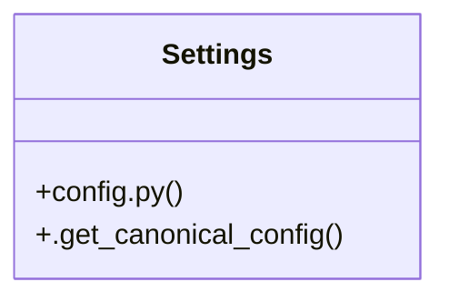

# Community 8

> 27 nodes · cohesion 0.08

## Key Concepts

- [load_canonical_config()](file:///E:/Non_Office/Dev_Space/vibe_skool/freeOcr/src/backend/app/config.py#L10) (9 connections)
- [config.py](file:///E:/Non_Office/Dev_Space/vibe_skool/freeOcr/src/backend/app/config.py#L1) (4 connections)
- [get_runtime_config()](file:///E:/Non_Office/Dev_Space/vibe_skool/freeOcr/src/backend/app/api/v1/endpoints/config.py#L9) (3 connections)
- [Settings](file:///E:/Non_Office/Dev_Space/vibe_skool/freeOcr/src/backend/app/config.py#L40) (3 connections)
- [test_adsense_config.py](file:///E:/Non_Office/Dev_Space/vibe_skool/freeOcr/src/tests/test_adsense_config.py#L1) (3 connections)
- [test_config_and_quotas.py](file:///E:/Non_Office/Dev_Space/vibe_skool/freeOcr/src/tests/test_config_and_quotas.py#L1) (3 connections)
- [test_limit_evaluator.py](file:///E:/Non_Office/Dev_Space/vibe_skool/freeOcr/src/tests/test_limit_evaluator.py#L1) (3 connections)
- [test_adsense_config_interval_loaded()](file:///E:/Non_Office/Dev_Space/vibe_skool/freeOcr/src/tests/test_adsense_config.py#L10) (3 connections)
- [test_limit_config_values()](file:///E:/Non_Office/Dev_Space/vibe_skool/freeOcr/src/tests/test_limit_evaluator.py#L10) (3 connections)
- [.get_canonical_config()](file:///E:/Non_Office/Dev_Space/vibe_skool/freeOcr/src/backend/app/config.py#L53) (2 connections)
- [test_adsense_config_api_endpoint()](file:///E:/Non_Office/Dev_Space/vibe_skool/freeOcr/src/tests/test_adsense_config.py#L20) (2 connections)
- [test_dynamic_config_file_reload()](file:///E:/Non_Office/Dev_Space/vibe_skool/freeOcr/src/tests/test_adsense_config.py#L31) (2 connections)
- [test_canonical_config_loader()](file:///E:/Non_Office/Dev_Space/vibe_skool/freeOcr/src/tests/test_config_and_quotas.py#L9) (2 connections)
- [test_dynamic_limit_config_reload()](file:///E:/Non_Office/Dev_Space/vibe_skool/freeOcr/src/tests/test_limit_evaluator.py#L35) (2 connections)
- [test_get_config_limits_endpoint()](file:///E:/Non_Office/Dev_Space/vibe_skool/freeOcr/src/tests/test_limit_evaluator.py#L23) (2 connections)
- **BaseSettings** (1 connections)
- [Returns the single canonical global runtime configuration (limits, quotas, engin](file:///E:/Non_Office/Dev_Space/vibe_skool/freeOcr/src/backend/app/api/v1/endpoints/config.py#L10) (1 connections)
- [Loads the single canonical configuration file.](file:///E:/Non_Office/Dev_Space/vibe_skool/freeOcr/src/backend/app/config.py#L11) (1 connections)
- [config.py](file:///E:/Non_Office/Dev_Space/vibe_skool/freeOcr/src/backend/app/api/v1/endpoints/config.py#L1) (1 connections)
- [Verify that monetization parameters are present in backend configuration.](file:///E:/Non_Office/Dev_Space/vibe_skool/freeOcr/src/tests/test_adsense_config.py#L11) (1 connections)
- [Verify that GET /api/v1/config endpoint returns monetization configuration.](file:///E:/Non_Office/Dev_Space/vibe_skool/freeOcr/src/tests/test_adsense_config.py#L21) (1 connections)
- [Verify that modifying monetization parameters in config file is reflected dynami](file:///E:/Non_Office/Dev_Space/vibe_skool/freeOcr/src/tests/test_adsense_config.py#L32) (1 connections)
- [test_get_config_endpoint()](file:///E:/Non_Office/Dev_Space/vibe_skool/freeOcr/src/tests/test_config_and_quotas.py#L17) (1 connections)
- [test_rewarded_ad_callback_stacking()](file:///E:/Non_Office/Dev_Space/vibe_skool/freeOcr/src/tests/test_config_and_quotas.py#L25) (1 connections)
- [Verify that canonical limits config contains base_max_file_mb, boost_per_ad_mb,](file:///E:/Non_Office/Dev_Space/vibe_skool/freeOcr/src/tests/test_limit_evaluator.py#L11) (1 connections)
- *... and 2 more nodes in this community*

## Class Diagram

## Relationships

- No strong cross-community connections detected

## Source Files

- [E:\Non_Office\Dev_Space\vibe_skool\freeOcr\src\backend\app\api\v1\endpoints\config.py](file:///E:/Non_Office/Dev_Space/vibe_skool/freeOcr/src/backend/app/api/v1/endpoints/config.py)
- [E:\Non_Office\Dev_Space\vibe_skool\freeOcr\src\backend\app\config.py](file:///E:/Non_Office/Dev_Space/vibe_skool/freeOcr/src/backend/app/config.py)
- [E:\Non_Office\Dev_Space\vibe_skool\freeOcr\src\tests\test_adsense_config.py](file:///E:/Non_Office/Dev_Space/vibe_skool/freeOcr/src/tests/test_adsense_config.py)
- [E:\Non_Office\Dev_Space\vibe_skool\freeOcr\src\tests\test_config_and_quotas.py](file:///E:/Non_Office/Dev_Space/vibe_skool/freeOcr/src/tests/test_config_and_quotas.py)
- [E:\Non_Office\Dev_Space\vibe_skool\freeOcr\src\tests\test_limit_evaluator.py](file:///E:/Non_Office/Dev_Space/vibe_skool/freeOcr/src/tests/test_limit_evaluator.py)

## Audit Trail

- EXTRACTED: 48 (83%)
- INFERRED: 10 (17%)
- AMBIGUOUS: 0 (0%)

---

*Part of the graphify knowledge wiki. See [[index]] to navigate.*