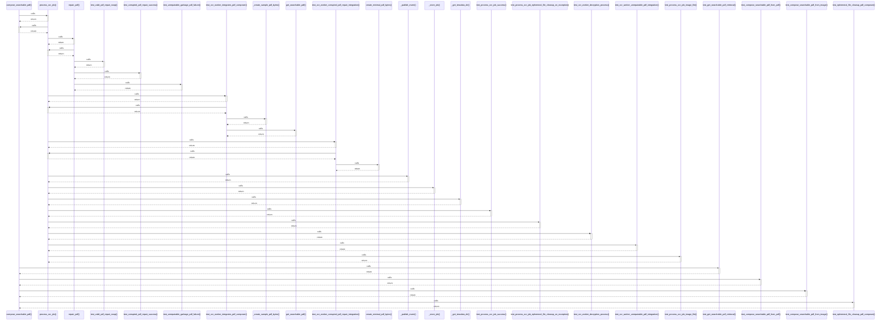

# compose_searchable_pdf()

> God node · 7 connections · [E:\Non_Office\Dev_Space\vibe_skool\freeOcr\src\backend\app\services\pdf_composer.py](file:///E:/Non_Office/Dev_Space/vibe_skool/freeOcr/src/backend/app/services/pdf_composer.py#L9)

## Call Trace Diagram

## Connections by Relation

### calls
- [[process_ocr_job()]] `INFERRED`
- [[test_get_searchable_pdf_retrieval()]] `INFERRED`
- [[test_compose_searchable_pdf_from_pdf()]] `INFERRED`
- [[test_compose_searchable_pdf_from_image()]] `INFERRED`
- [[test_ephemeral_file_cleanup_pdf_composer()]] `INFERRED`

### contains
- [[pdf_composer.py]] `EXTRACTED`

### rationale_for
- [[Overlays invisible text (render_mode=3) onto PDF or image pages using bounding b]] `EXTRACTED`

---

*Part of the graphify knowledge wiki. See [[index]] to navigate.*