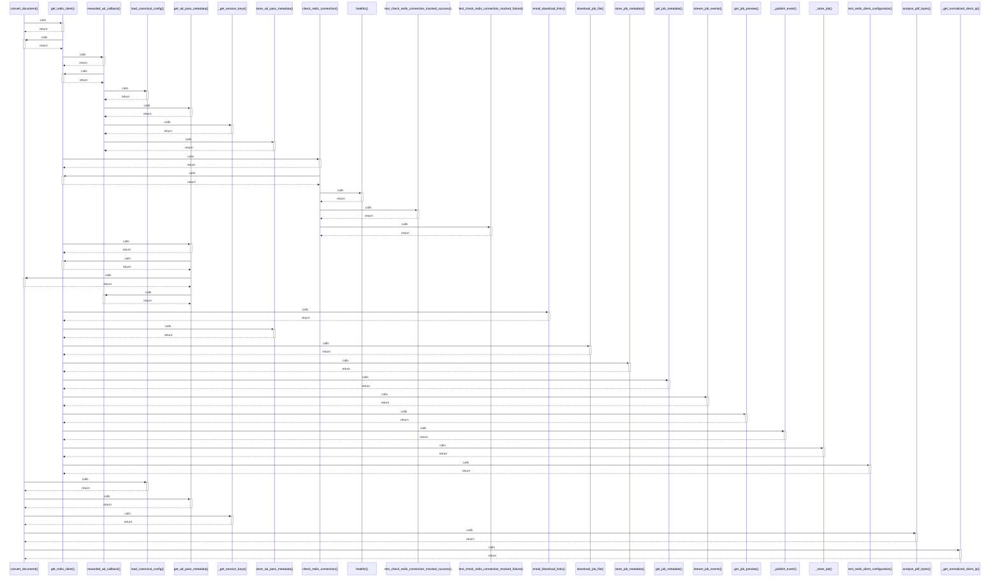

# convert_document()

> God node · 8 connections · [E:\Non_Office\Dev_Space\vibe_skool\freeOcr\src\backend\app\api\v1\endpoints\ocr.py](file:///E:/Non_Office/Dev_Space/vibe_skool/freeOcr/src/backend/app/api/v1/endpoints/ocr.py#L140)

## Call Trace Diagram

## Connections by Relation

### calls
- [[get_redis_client()]] `INFERRED`
- [[load_canonical_config()]] `INFERRED`
- [[get_ad_pass_metadata()]] `INFERRED`
- [[_get_session_keys()]] `EXTRACTED`
- [[analyze_pdf_bytes()]] `INFERRED`
- [[_get_normalized_client_ip()]] `EXTRACTED`

### contains
- [[ocr.py]] `EXTRACTED`

### rationale_for
- [[Endpoint for uploading PDF/image files for OCR conversion.     Validates extens]] `EXTRACTED`

---

*Part of the graphify knowledge wiki. See [[index]] to navigate.*