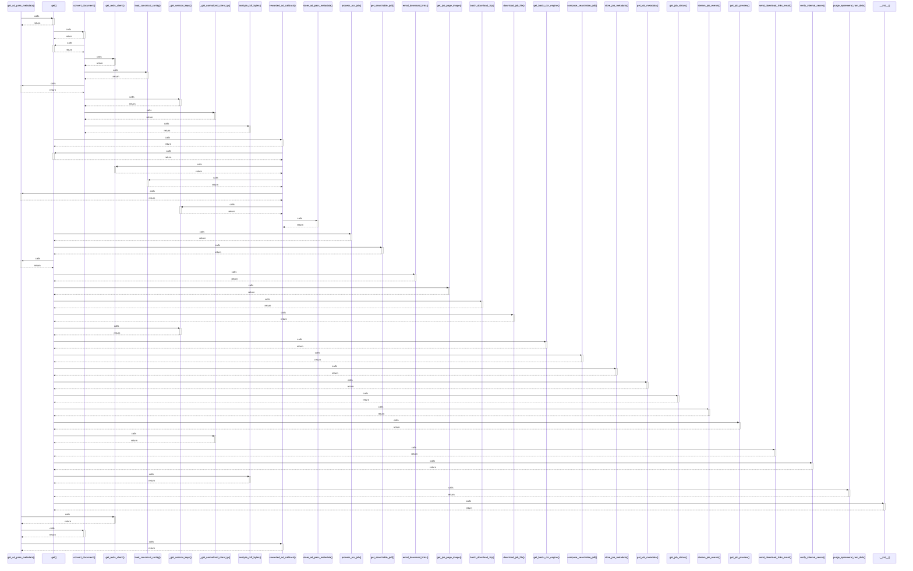

# get_ad_pass_metadata()

> God node · 6 connections · [E:\Non_Office\Dev_Space\vibe_skool\freeOcr\src\backend\app\redis_client.py](file:///E:/Non_Office/Dev_Space/vibe_skool/freeOcr/src/backend/app/redis_client.py#L142)

## Call Trace Diagram

## Connections by Relation

### calls
- [[.get()]] `EXTRACTED`
- [[get_redis_client()]] `EXTRACTED`
- [[convert_document()]] `INFERRED`
- [[rewarded_ad_callback()]] `INFERRED`

### contains
- [[redis_client.py]] `EXTRACTED`

### rationale_for
- [[Retrieves ad pass payload dict from Redis, falling back to in-memory store.]] `EXTRACTED`

---

*Part of the graphify knowledge wiki. See [[index]] to navigate.*