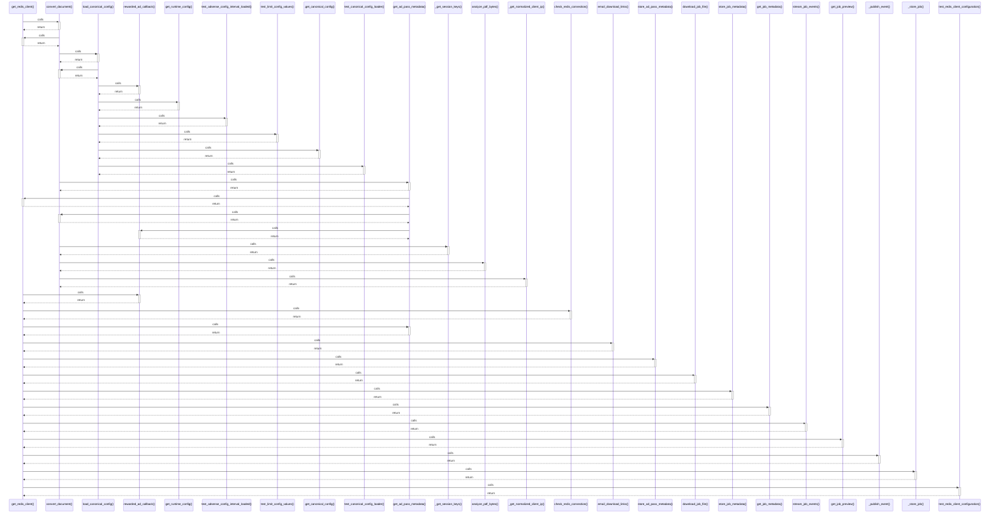

# get_redis_client()

> God node · 15 connections · [E:\Non_Office\Dev_Space\vibe_skool\freeOcr\src\backend\app\redis_client.py](file:///E:/Non_Office/Dev_Space/vibe_skool/freeOcr/src/backend/app/redis_client.py#L9)

## Call Trace Diagram

## Connections by Relation

### calls
- [[convert_document()]] `INFERRED`
- [[rewarded_ad_callback()]] `INFERRED`
- [[check_redis_connection()]] `EXTRACTED`
- [[get_ad_pass_metadata()]] `EXTRACTED`
- [[email_download_links()]] `INFERRED`
- [[store_ad_pass_metadata()]] `EXTRACTED`
- [[download_job_file()]] `INFERRED`
- [[store_job_metadata()]] `EXTRACTED`
- [[get_job_metadata()]] `EXTRACTED`
- [[stream_job_events()]] `INFERRED`
- [[get_job_preview()]] `INFERRED`
- [[_publish_event()]] `INFERRED`
- [[_store_job()]] `INFERRED`
- [[test_redis_client_configuration()]] `INFERRED`

### contains
- [[redis_client.py]] `EXTRACTED`

---

*Part of the graphify knowledge wiki. See [[index]] to navigate.*