# Knowledge Graph Index

> Auto-generated by graphify. Start here — read community articles for context, then drill into god nodes for detail.

**874 nodes · 1103 edges · 58 communities**

---

## System Architecture Flowchart

```mermaid
flowchart TD
    C0["Community 0 (108 nodes)"]
    C1["Community 1 (104 nodes)"]
    C2["Community 2 (93 nodes)"]
    C3["Community 3 (64 nodes)"]
    C4["Community 4 (47 nodes)"]
    C5["Community 5 (43 nodes)"]
    C6["Community 6 (41 nodes)"]
    C7["Community 7 (37 nodes)"]
    C8["Community 8 (37 nodes)"]
    C9["Community 9 (35 nodes)"]
    C10["Community 10 (34 nodes)"]
    C11["Community 11 (25 nodes)"]
    C12["Community 12 (24 nodes)"]
    C13["Community 13 (23 nodes)"]
    C14["Community 14 (22 nodes)"]
    C15["Community 15 (17 nodes)"]
    C16["Community 16 (16 nodes)"]
    C17["Community 17 (16 nodes)"]
    C18["Community 18 (9 nodes)"]
    C19["unknown (7 nodes)"]
    C20["Community 20 (7 nodes)"]
    C21["unknown (5 nodes)"]
    C22["Community 22 (4 nodes)"]
    C23["Community 23 (4 nodes)"]
    C24["Community 24 (4 nodes)"]
    C25["unknown (4 nodes)"]
    C26["Community 26 (3 nodes)"]
    C27["unknown (3 nodes)"]
    C28["Community 28 (3 nodes)"]
    C29["unknown (3 nodes)"]
    C30["unknown (2 nodes)"]
    C31["unknown (2 nodes)"]
    C32["unknown (2 nodes)"]
    C33["Community 33 (2 nodes)"]
    C34["unknown (1 nodes)"]
    C35["unknown (1 nodes)"]
    C36["unknown (1 nodes)"]
    C37["Community 37 (1 nodes)"]
    C38["unknown (1 nodes)"]
    C39["unknown (1 nodes)"]
    C40["Community 40 (1 nodes)"]
    C41["unknown (1 nodes)"]
    C42["unknown (1 nodes)"]
    C43["unknown (1 nodes)"]
    C44["unknown (1 nodes)"]
    C45["Community 45 (1 nodes)"]
    C46["Community 46 (1 nodes)"]
    C47["Community 47 (1 nodes)"]
    C48["Community 48 (1 nodes)"]
    C49["Community 49 (1 nodes)"]
    C50["Community 50 (1 nodes)"]
    C51["Community 51 (1 nodes)"]
    C52["Community 52 (1 nodes)"]
    C53["Community 53 (1 nodes)"]
    C54["Community 54 (1 nodes)"]
    C55["Community 55 (1 nodes)"]
    C56["Community 56 (1 nodes)"]
    C57["Community 57 (1 nodes)"]
    C0 -->|15 edges| C5
    C0 -->|12 edges| C9
    C7 -->|6 edges| C2
    C1 -->|6 edges| C2
    C2 -->|6 edges| C10
    C2 -->|4 edges| C4
    C3 -->|3 edges| C0
    C0 -->|3 edges| C12
    C9 -->|3 edges| C11
    C8 -->|3 edges| C6
    C1 -->|3 edges| C8
    C0 -->|2 edges| C16
    C0 -->|2 edges| C11
    C0 -->|2 edges| C19
    C12 -->|2 edges| C5
    C9 -->|2 edges| C0
    C8 -->|2 edges| C3
    C1 -->|2 edges| C13
    C1 -->|2 edges| C4
    C2 -->|2 edges| C3
    C6 -->|2 edges| C14
    C6 -->|2 edges| C4
    C6 -->|2 edges| C3
    C3 -->|1 edges| C5
    C5 -->|1 edges| C3
    C0 -->|1 edges| C20
    C5 -->|1 edges| C12
    C16 -->|1 edges| C9
    C7 -->|1 edges| C8
    C7 -->|1 edges| C1
    C7 -->|1 edges| C4
    C8 -->|1 edges| C14
    C8 -->|1 edges| C13
    C8 -->|1 edges| C4
    C1 -->|1 edges| C10
    C1 -->|1 edges| C14
    C1 -->|1 edges| C17
    C1 -->|1 edges| C6
    C1 -->|1 edges| C15
    C1 -->|1 edges| C3
    C2 -->|1 edges| C8
    C13 -->|1 edges| C2
    C13 -->|1 edges| C10
    C13 -->|1 edges| C8
    C2 -->|1 edges| C13
    C6 -->|1 edges| C8
    C6 -->|1 edges| C1
    C4 -->|1 edges| C3
```

## Communities
(sorted by size, largest first)

- [[Community 0]] — 108 nodes
- [[Community 1]] — 104 nodes
- [[Community 2]] — 93 nodes
- [[Community 3]] — 64 nodes
- [[Community 4]] — 47 nodes
- [[Community 5]] — 43 nodes
- [[Community 6]] — 41 nodes
- [[Community 7]] — 37 nodes
- [[Community 8]] — 37 nodes
- [[Community 9]] — 35 nodes
- [[Community 10]] — 34 nodes
- [[Community 11]] — 25 nodes
- [[Community 12]] — 24 nodes
- [[Community 13]] — 23 nodes
- [[Community 14]] — 22 nodes
- [[Community 15]] — 17 nodes
- [[Community 16]] — 16 nodes
- [[Community 17]] — 16 nodes
- [[Community 18]] — 9 nodes
- [[unknown]] — 7 nodes
- [[Community 20]] — 7 nodes
- [[unknown]] — 5 nodes
- [[Community 22]] — 4 nodes
- [[Community 23]] — 4 nodes
- [[Community 24]] — 4 nodes
- [[unknown]] — 4 nodes
- [[Community 26]] — 3 nodes
- [[unknown]] — 3 nodes
- [[Community 28]] — 3 nodes
- [[unknown]] — 3 nodes
- [[unknown]] — 2 nodes
- [[unknown]] — 2 nodes
- [[unknown]] — 2 nodes
- [[Community 33]] — 2 nodes
- [[unknown]] — 1 nodes
- [[unknown]] — 1 nodes
- [[unknown]] — 1 nodes
- [[Community 37]] — 1 nodes
- [[unknown]] — 1 nodes
- [[unknown]] — 1 nodes
- [[Community 40]] — 1 nodes
- [[unknown]] — 1 nodes
- [[unknown]] — 1 nodes
- [[unknown]] — 1 nodes
- [[unknown]] — 1 nodes
- [[Community 45]] — 1 nodes
- [[Community 46]] — 1 nodes
- [[Community 47]] — 1 nodes
- [[Community 48]] — 1 nodes
- [[Community 49]] — 1 nodes
- [[Community 50]] — 1 nodes
- [[Community 51]] — 1 nodes
- [[Community 52]] — 1 nodes
- [[Community 53]] — 1 nodes
- [[Community 54]] — 1 nodes
- [[Community 55]] — 1 nodes
- [[Community 56]] — 1 nodes
- [[Community 57]] — 1 nodes

## God Nodes
(most connected concepts — the load-bearing abstractions)

- [[package:flutter/material.dart]] — 42 connections
- [[get_redis_client()]] — 20 connections
- [[EphemeralRamStore]] — 18 connections
- [[process_ocr_job()]] — 17 connections
- [[package:flutter_test/flutter_test.dart]] — 16 connections
- [[package:flutter/foundation.dart]] — 12 connections
- [[compose_searchable_pdf()]] — 11 connections
- [[../services/telemetry_service.dart]] — 11 connections
- [[get_searchable_pdf()]] — 10 connections
- [[dart:async]] — 10 connections

---

*Generated by [graphify](https://github.com/safishamsi/graphify)*