# Knowledge Graph Index

> Auto-generated by graphify. Start here — read community articles for context, then drill into god nodes for detail.

**450 nodes · 527 edges · 35 communities**

---

## System Architecture Flowchart

```mermaid
flowchart TD
    C0["Community 0 (53 nodes)"]
    C1["Community 1 (52 nodes)"]
    C2["Community 2 (38 nodes)"]
    C3["Community 3 (38 nodes)"]
    C4["Community 4 (34 nodes)"]
    C5["Community 5 (32 nodes)"]
    C6["Community 6 (25 nodes)"]
    C7["Community 7 (20 nodes)"]
    C8["Community 8 (19 nodes)"]
    C9["Community 9 (19 nodes)"]
    C10["Community 10 (13 nodes)"]
    C11["Community 11 (11 nodes)"]
    C12["Community 12 (8 nodes)"]
    C13["Community 13 (8 nodes)"]
    C14["Community 14 (7 nodes)"]
    C15["Community 15 (7 nodes)"]
    C16["Community 16 (7 nodes)"]
    C17["Community 17 (7 nodes)"]
    C18["Community 18 (7 nodes)"]
    C19["unknown (6 nodes)"]
    C20["Community 20 (5 nodes)"]
    C21["unknown (5 nodes)"]
    C22["Community 22 (4 nodes)"]
    C23["Community 23 (4 nodes)"]
    C24["Community 24 (4 nodes)"]
    C25["unknown (3 nodes)"]
    C26["Community 26 (3 nodes)"]
    C27["unknown (3 nodes)"]
    C28["Community 28 (2 nodes)"]
    C29["unknown (1 nodes)"]
    C30["unknown (1 nodes)"]
    C31["unknown (1 nodes)"]
    C32["unknown (1 nodes)"]
    C33["Community 33 (1 nodes)"]
    C34["unknown (1 nodes)"]
    C0 -->|3 edges| C7
    C0 -->|2 edges| C3
    C0 -->|2 edges| C10
    C3 -->|2 edges| C7
    C5 -->|2 edges| C2
    C5 -->|2 edges| C8
    C2 -->|2 edges| C8
    C0 -->|1 edges| C15
    C0 -->|1 edges| C17
    C0 -->|1 edges| C14
    C14 -->|1 edges| C0
    C0 -->|1 edges| C16
    C16 -->|1 edges| C0
    C3 -->|1 edges| C13
    C5 -->|1 edges| C1
    C1 -->|1 edges| C5
    C1 -->|1 edges| C6
    C1 -->|1 edges| C2
    C1 -->|1 edges| C8
    C1 -->|1 edges| C9
    C1 -->|1 edges| C4
    C5 -->|1 edges| C9
    C5 -->|1 edges| C4
    C2 -->|1 edges| C9
    C2 -->|1 edges| C4
    C9 -->|1 edges| C4
    C4 -->|1 edges| C14
```

## Communities
(sorted by size, largest first)

- [[Community 0]] — 53 nodes
- [[Community 1]] — 52 nodes
- [[Community 2]] — 38 nodes
- [[Community 3]] — 38 nodes
- [[Community 4]] — 34 nodes
- [[Community 5]] — 32 nodes
- [[Community 6]] — 25 nodes
- [[Community 7]] — 20 nodes
- [[Community 8]] — 19 nodes
- [[Community 9]] — 19 nodes
- [[Community 10]] — 13 nodes
- [[Community 11]] — 11 nodes
- [[Community 12]] — 8 nodes
- [[Community 13]] — 8 nodes
- [[Community 14]] — 7 nodes
- [[Community 15]] — 7 nodes
- [[Community 16]] — 7 nodes
- [[Community 17]] — 7 nodes
- [[Community 18]] — 7 nodes
- [[unknown]] — 6 nodes
- [[Community 20]] — 5 nodes
- [[unknown]] — 5 nodes
- [[Community 22]] — 4 nodes
- [[Community 23]] — 4 nodes
- [[Community 24]] — 4 nodes
- [[unknown]] — 3 nodes
- [[Community 26]] — 3 nodes
- [[unknown]] — 3 nodes
- [[Community 28]] — 2 nodes
- [[unknown]] — 1 nodes
- [[unknown]] — 1 nodes
- [[unknown]] — 1 nodes
- [[unknown]] — 1 nodes
- [[Community 33]] — 1 nodes
- [[unknown]] — 1 nodes

## God Nodes
(most connected concepts — the load-bearing abstractions)

- [[package:flutter/material.dart]] — 19 connections
- [[get_redis_client()]] — 15 connections
- [[process_ocr_job()]] — 14 connections
- [[load_canonical_config()]] — 9 connections
- [[package:flutter_test/flutter_test.dart]] — 9 connections
- [[convert_document()]] — 8 connections
- [[rewarded_ad_callback()]] — 7 connections
- [[compose_searchable_pdf()]] — 7 connections
- [[LayoutAnalyzer]] — 6 connections
- [[repair_pdf()]] — 6 connections

---

*Generated by [graphify](https://github.com/safishamsi/graphify)*