# Knowledge Graph Index

> Auto-generated by graphify. Start here — read community articles for context, then drill into god nodes for detail.

**651 nodes · 759 edges · 44 communities**

---

## System Architecture Flowchart

```mermaid
flowchart TD
    C0["Community 0 (73 nodes)"]
    C1["Community 1 (66 nodes)"]
    C2["Community 2 (59 nodes)"]
    C3["Community 3 (49 nodes)"]
    C4["Community 4 (47 nodes)"]
    C5["Community 5 (44 nodes)"]
    C6["Community 6 (38 nodes)"]
    C7["Community 7 (33 nodes)"]
    C8["Community 8 (25 nodes)"]
    C9["Community 9 (20 nodes)"]
    C10["Community 10 (19 nodes)"]
    C11["Community 11 (17 nodes)"]
    C12["Community 12 (13 nodes)"]
    C13["Community 13 (13 nodes)"]
    C14["Community 14 (11 nodes)"]
    C15["Community 15 (10 nodes)"]
    C16["Community 16 (9 nodes)"]
    C17["Community 17 (8 nodes)"]
    C18["Community 18 (8 nodes)"]
    C19["unknown (8 nodes)"]
    C20["Community 20 (7 nodes)"]
    C21["unknown (7 nodes)"]
    C22["Community 22 (7 nodes)"]
    C23["Community 23 (6 nodes)"]
    C24["Community 24 (6 nodes)"]
    C25["unknown (5 nodes)"]
    C26["Community 26 (5 nodes)"]
    C27["unknown (4 nodes)"]
    C28["Community 28 (4 nodes)"]
    C29["unknown (4 nodes)"]
    C30["unknown (4 nodes)"]
    C31["unknown (3 nodes)"]
    C32["unknown (3 nodes)"]
    C33["Community 33 (3 nodes)"]
    C34["unknown (2 nodes)"]
    C35["unknown (2 nodes)"]
    C36["unknown (2 nodes)"]
    C37["Community 37 (1 nodes)"]
    C38["unknown (1 nodes)"]
    C39["unknown (1 nodes)"]
    C40["Community 40 (1 nodes)"]
    C41["unknown (1 nodes)"]
    C42["unknown (1 nodes)"]
    C43["unknown (1 nodes)"]
    C8 -->|6 edges| C1
    C1 -->|6 edges| C4
    C0 -->|4 edges| C1
    C0 -->|3 edges| C7
    C3 -->|2 edges| C2
    C2 -->|2 edges| C6
    C2 -->|2 edges| C12
    C6 -->|2 edges| C13
    C5 -->|2 edges| C10
    C0 -->|2 edges| C4
    C1 -->|2 edges| C10
    C1 -->|2 edges| C9
    C1 -->|2 edges| C3
    C2 -->|1 edges| C3
    C2 -->|1 edges| C20
    C2 -->|1 edges| C21
    C2 -->|1 edges| C13
    C6 -->|1 edges| C19
    C8 -->|1 edges| C5
    C8 -->|1 edges| C0
    C8 -->|1 edges| C9
    C0 -->|1 edges| C23
    C0 -->|1 edges| C5
    C0 -->|1 edges| C10
    C0 -->|1 edges| C11
    C0 -->|1 edges| C9
    C0 -->|1 edges| C17
    C0 -->|1 edges| C3
    C1 -->|1 edges| C7
    C5 -->|1 edges| C9
    C5 -->|1 edges| C7
    C5 -->|1 edges| C3
    C7 -->|1 edges| C3
    C10 -->|1 edges| C9
```

## Communities
(sorted by size, largest first)

- [[Community 0]] — 73 nodes
- [[Community 1]] — 66 nodes
- [[Community 2]] — 59 nodes
- [[Community 3]] — 49 nodes
- [[Community 4]] — 47 nodes
- [[Community 5]] — 44 nodes
- [[Community 6]] — 38 nodes
- [[Community 7]] — 33 nodes
- [[Community 8]] — 25 nodes
- [[Community 9]] — 20 nodes
- [[Community 10]] — 19 nodes
- [[Community 11]] — 17 nodes
- [[Community 12]] — 13 nodes
- [[Community 13]] — 13 nodes
- [[Community 14]] — 11 nodes
- [[Community 15]] — 10 nodes
- [[Community 16]] — 9 nodes
- [[Community 17]] — 8 nodes
- [[Community 18]] — 8 nodes
- [[unknown]] — 8 nodes
- [[Community 20]] — 7 nodes
- [[unknown]] — 7 nodes
- [[Community 22]] — 7 nodes
- [[Community 23]] — 6 nodes
- [[Community 24]] — 6 nodes
- [[unknown]] — 5 nodes
- [[Community 26]] — 5 nodes
- [[unknown]] — 4 nodes
- [[Community 28]] — 4 nodes
- [[unknown]] — 4 nodes
- [[unknown]] — 4 nodes
- [[unknown]] — 3 nodes
- [[unknown]] — 3 nodes
- [[Community 33]] — 3 nodes
- [[unknown]] — 2 nodes
- [[unknown]] — 2 nodes
- [[unknown]] — 2 nodes
- [[Community 37]] — 1 nodes
- [[unknown]] — 1 nodes
- [[unknown]] — 1 nodes
- [[Community 40]] — 1 nodes
- [[unknown]] — 1 nodes
- [[unknown]] — 1 nodes
- [[unknown]] — 1 nodes

## God Nodes
(most connected concepts — the load-bearing abstractions)

- [[package:flutter/material.dart]] — 32 connections
- [[get_redis_client()]] — 15 connections
- [[process_ocr_job()]] — 14 connections
- [[package:flutter_test/flutter_test.dart]] — 14 connections
- [[load_canonical_config()]] — 9 connections
- [[../services/telemetry_service.dart]] — 9 connections
- [[convert_document()]] — 8 connections
- [[rewarded_ad_callback()]] — 7 connections
- [[compose_searchable_pdf()]] — 7 connections
- [[dart:async]] — 7 connections

---

*Generated by [graphify](https://github.com/safishamsi/graphify)*