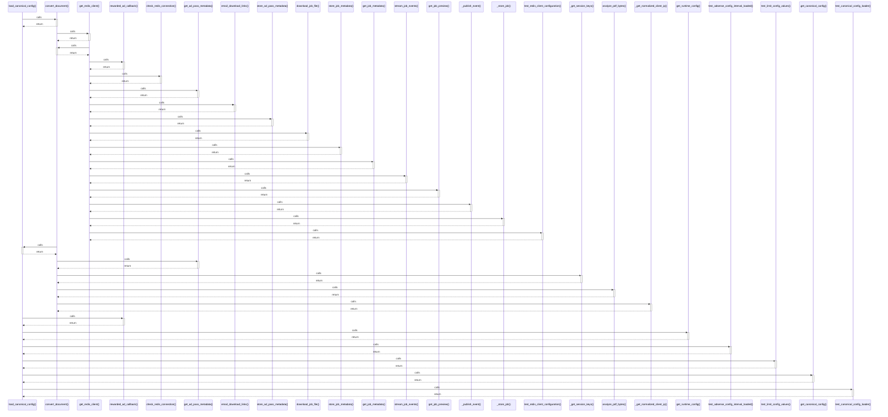

# load_canonical_config()

> God node · 9 connections · [E:\Non_Office\Dev_Space\vibe_skool\freeOcr\src\backend\app\config.py](file:///E:/Non_Office/Dev_Space/vibe_skool/freeOcr/src/backend/app/config.py#L10)

## Call Trace Diagram

## Connections by Relation

### calls
- [[convert_document()]] `INFERRED`
- [[rewarded_ad_callback()]] `INFERRED`
- [[get_runtime_config()]] `INFERRED`
- [[test_adsense_config_interval_loaded()]] `INFERRED`
- [[test_limit_config_values()]] `INFERRED`
- [[.get_canonical_config()]] `EXTRACTED`
- [[test_canonical_config_loader()]] `INFERRED`

### contains
- [[config.py]] `EXTRACTED`

### rationale_for
- [[Loads the single canonical configuration file.]] `EXTRACTED`

---

*Part of the graphify knowledge wiki. See [[index]] to navigate.*