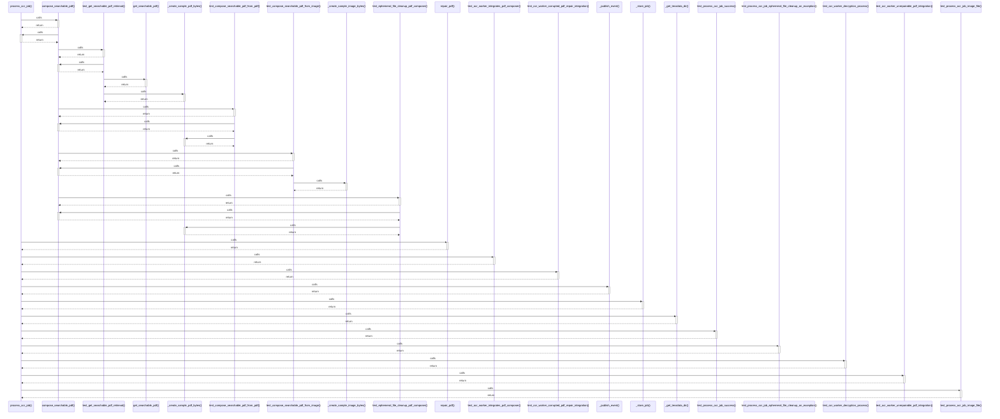

# process_ocr_job()

> God node · 14 connections · [E:\Non_Office\Dev_Space\vibe_skool\freeOcr\src\backend\app\services\ocr_worker.py](file:///E:/Non_Office/Dev_Space/vibe_skool/freeOcr/src/backend/app/services/ocr_worker.py#L46)

## Call Trace Diagram

## Connections by Relation

### calls
- [[compose_searchable_pdf()]] `INFERRED`
- [[repair_pdf()]] `INFERRED`
- [[test_ocr_worker_integrates_pdf_composer()]] `INFERRED`
- [[test_ocr_worker_corrupted_pdf_repair_integration()]] `INFERRED`
- [[_publish_event()]] `EXTRACTED`
- [[_store_job()]] `EXTRACTED`
- [[_get_tessdata_dir()]] `EXTRACTED`
- [[test_process_ocr_job_success()]] `INFERRED`
- [[test_process_ocr_job_ephemeral_file_cleanup_on_exception()]] `INFERRED`
- [[test_ocr_worker_decryption_process()]] `INFERRED`
- [[test_ocr_worker_unrepairable_pdf_integration()]] `INFERRED`
- [[test_process_ocr_job_image_file()]] `INFERRED`

### contains
- [[ocr_worker.py]] `EXTRACTED`

### rationale_for
- [[Executes page-by-page OCR extraction on uploaded PDF or image file bytes.     S]] `EXTRACTED`

---

*Part of the graphify knowledge wiki. See [[index]] to navigate.*