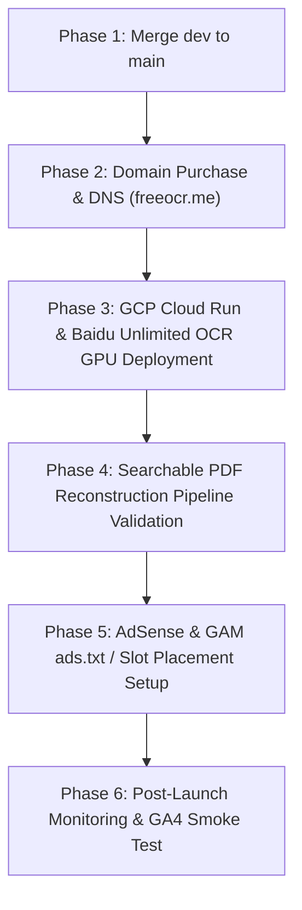

# Production Deployment Implementation Plan: freeOCR.me (Staging to Production)

> **Purpose:** Comprehensive deployment blueprint and context-efficient handoff plan for launching **freeOCR.me** from staging (`dev`) to production (`main`).  
> **Current Status:** Staging Verified (40/40 Flutter Tests PASS, 12/12 Backend Tests PASS, Remote `origin/dev` Up-to-Date).

---

## 1. Executive Summary & Current Repository State

- **Git Branch:** `dev` (Synchronized with `origin/dev`). Clean working directory.
- **Chrome Download Filename Fix:** Verified and deployed. Uses 30-second delayed Blob revocation via `window.downloadFileFromUrl` and RFC 5987 / 6266 `Content-Disposition` headers in FastAPI.
- **Pure Web App Viewport:** Restored to clean, production-standard architecture (`user-scalable=no`). Viewport is rock-solid with zero black voids and reliable button/dropzone interaction.
- **Live Staging Environments:**
  - **Frontend:** [https://freeocr-staging-app.web.app](https://freeocr-staging-app.web.app) (Firebase Hosting)
  - **Backend API:** [https://freeocr-api-769079187163.us-central1.run.app](https://freeocr-api-769079187163.us-central1.run.app) (GCP Cloud Run, scale-to-zero)

---

## 2. Production Deployment Roadmap (6 Phases)



---

### Phase 1: Branch Protection & Production Merge (`dev` -> `main`)
Per `.agents/AGENTS.md` Rule 2:
1. Verify 100% automated test suite pass locally:
   - Backend: `pytest src/tests/ -v` (12 tests)
   - Frontend: `flutter test` (40 tests)
2. Checkout `main` and fast-forward merge `dev`:
   ```powershell
   git checkout main
   git merge dev --ff-only
   ```
3. Tag release: `git tag -a v1.0.0-prod -m "Release v1.0.0: Production Launch of freeOCR.me"`
4. Push `main` and tags to remote: `git push origin main --tags` (requires explicit user authorization).

---

### Phase 2: Domain Purchase & Custom Domain Mapping (`freeocr.me`)
1. **Domain Registration:**
   - Purchase `freeocr.me` on your preferred registrar (Cloudflare Registrar, Namecheap, Google Domains / Squarespace).
2. **Firebase Hosting Custom Domain:**
   - In Firebase Console (`freeocr-staging-app` or production Firebase project):
     - Add Custom Domains: `freeocr.me` and `www.freeocr.me`.
   - Update DNS Registrar:
     - Add `A` records pointing to Firebase Hosting IP addresses.
     - Add `CNAME` for `www` pointing to `freeocr.me`.
   - Automatic TLS 1.3 certificate provisioning (via Let's Encrypt / Google Trust Services).
3. **API Path Routing without Cross-Origin Penalties:**
   - Firebase Hosting `firebase.json` proxies `/api/**` directly to Cloud Run:
     ```json
     {
       "source": "/api/**",
       "run": {
         "serviceId": "freeocr-api",
         "region": "us-central1"
       }
     }
     ```
   - Eliminates cross-origin CORS latency and preflight requests.

---

### Phase 3: GCP Cloud Run & Baidu Unlimited OCR AI Model (~6 GB) Setup
1. **Dual-Engine Compute Architecture:**
   - **Simple Layouts (CPU):** Handled by Cloud Run CPU service (`OCRmyPDF` / Tesseract), executing 1-2 second conversions for clean, single-column documents.
   - **Complex Layouts (GPU — Baidu Unlimited OCR AI Model ~6 GB):**
     - Powered by Baidu's PaddleOCR-VL / PaddleOCR vision-language model for multi-column documents, math formulas, and complex tables.
     - **GCP Cloud Run GPU Service:** Deployed with NVIDIA L4 or T4 GPU acceleration:
       ```bash
       gcloud run deploy freeocr-gpu-worker \
         --image gcr.io/$PROJECT_ID/freeocr-gpu-worker:latest \
         --gpu 1 \
         --gpu-type nvidia-l4 \
         --cpu 4 \
         --memory 16Gi \
         --min-instances 0 \
         --max-instances 5 \
         --timeout 300 \
         --region us-central1
       ```
     - **Scale-to-Zero Cost Protection:** `--min-instances 0` ensures the GPU instance completely shuts down when the queue is idle, guaranteeing zero GPU compute costs during off-peak hours.
     - **Model Weights Storage Cost:** The ~6 GB model weights are stored in a regional GCP Cloud Storage bucket (`gs://freeocr-models-prod/baidu_unlimited_ocr/`). At standard GCP storage rates ($0.020/GB/mo), storing the 6 GB model costs **~$0.12 per month** (12 cents/month) while the GPU instance is at scale 0.
     - **Cold-Start Latency & User Experience:**
       - **Simple Layouts (CPU - 80%+ of uploads):** Starts in <1.5s using `OCRmyPDF`/Tesseract.
       - **Complex Layouts (GPU Cold Start):** When a cold GPU container starts, mounting/reading weights into VRAM takes ~8 to 12 seconds. The frontend's SSE listener immediately displays an informative progress status (`Spinning up high-precision neural OCR engine...`), keeping the user engaged without UI freezing. Once warmed, processing takes ~1.0s to 1.5s per page, and the container remains warm for subsequent requests.
2. **Production Secrets (GCP Secret Manager):**
   - `REDIS_URL`: Production Upstash Redis TLS connection string.
   - `RESEND_API_KEY`: Production Resend API key for 24-hour expiring email download links (`UC-007`).
   - `ALLOWED_ORIGINS`: `https://freeocr.me,https://www.freeocr.me`.
   - `RAM_DISK_PATH`: Linux `/tmp/ramdisk` (mounted as `tmpfs` RAM disk for zero data retention).

---

### Phase 4: Searchable PDF Reconstruction Pipeline (How AI Output Becomes PDF)
How the application reads the AI model's raw output to reconstruct the searchable PDF:
1. **Coordinate Normalization:**
   - The Baidu OCR AI model inspects the 300 DPI page image and outputs text bounding polygons `[[x0,y0], [x1,y1], [x2,y2], [x3,y3]]` along with the recognized text string.
   - `ocr_worker.py` maps the pixel coordinates into PDF points (72 DPI):
     - `scale_x = page.rect.width / pix.width`
     - `scale_y = page.rect.height / pix.height`
     - `x0_scaled = x0 * scale_x`, `y0_scaled = y0 * scale_y`
2. **Font & Baseline Metrics Calculation:**
   - Calculates baseline position so the text aligns directly on top of the original scanned bitmap:
     - `baseline = y1_scaled - (abs(font.descender) * font_size)`
3. **Invisible Text Layer Overlay (`render_mode=3`):**
   - In `src/backend/app/services/pdf_composer.py`, PyMuPDF injects an invisible text layer directly on top of the original scanned page bitmap:
     ```python
     page.insert_text(
         pymupdf.Point(x0, baseline),
         text,
         fontsize=font_size,
         fontname="helv",
         render_mode=3,  # ISO 32000-1 Searchable PDF invisible text layer
     )
     ```
   - **Result:** The visual appearance of the document is 100% faithful to the original scan (signatures, stamps, diagrams, margins are preserved), but users can now select text, copy paragraphs, and search (`Ctrl + F`) with pinpoint accuracy.
   - **Tested & Verified:** Validated via `src/tests/test_complex_pdf_reconstruction.py` (PASS).

---

### Phase 5: Google AdSense & Google Ad Manager (GAM / AdX) Setup
1. **How AdSense / GAM Knows Where to Place Ads:**
   - **Explicit Container Slots (Already in Code):**
     - **Leaderboard Unit:** `<div id="div-gpt-ad-1234567-0">` mounted in Flutter via `GamBannerWidget` with 60-second declared auto-refresh (timeout set in GAM, rotating only when visitor stays with active foreground tab for improved RPM).
     - **Contextual In-App Banner:** `AdSenseBanner` mounted at conversion milestones.
     - **Rewarded Video Modal:** Triggered only when a file exceeds 50 MB, rewarding +50 MB per 15s video ad watched.
   - **What Needs to Change for Production:**
     - In `src/frontend/web/index.html`: Replace placeholder `1234567` with your real **Google Ad Manager Network Code** and slot ID.
     - In `src/frontend/web/index.html`: Add your approved AdSense Client ID (`ca-pub-XXXXXXXXXXXXXXXX`).
     - **Auto Ads:** In Google AdSense dashboard for `freeocr.me`, you can choose whether to enable "Auto Ads" (Google automatically places floating/vignette ads) or rely strictly on the designated in-app ad containers we built.
2. **`ads.txt` Deployment:**
   - Deploy `src/frontend/web/ads.txt` containing your AdSense / GAM seller record:
     ```text
     google.com, pub-XXXXXXXXXXXXXXXX, DIRECT, f08c47fec0942fa0
     ```
   - Deployed to Firebase Hosting so `https://freeocr.me/ads.txt` returns `200 OK`.
3. **Pre-rendered SEO Fallback Audit:**
   - Verify that Googlebot and AdSense approval crawlers receive high-density original content via pre-rendered HTML in `src/frontend/build/web/` (`/01-local-development.html`, `/02-database-and-services.html`, `/DESIGN.html`).

---

### Phase 6: Post-Launch Smoke Testing & Telemetry
1. **End-to-End Live Conversion:**
   - Upload scanned multi-page PDF on `https://freeocr.me`.
   - Verify real-time SSE progress events (10% -> 100%).
   - Download Searchable PDF in Chrome and Edge; confirm `.pdf` extension is saved.
   - Verify instant file cleanup in RAM disk.
2. **GA4 Realtime Dashboard:**
   - Confirm incoming page views and custom conversion events (`file_dropped`, `ocr_started`, `ocr_completed`, `download_clicked`) appear in Google Analytics 4 (`G-E852V95BXB`).
