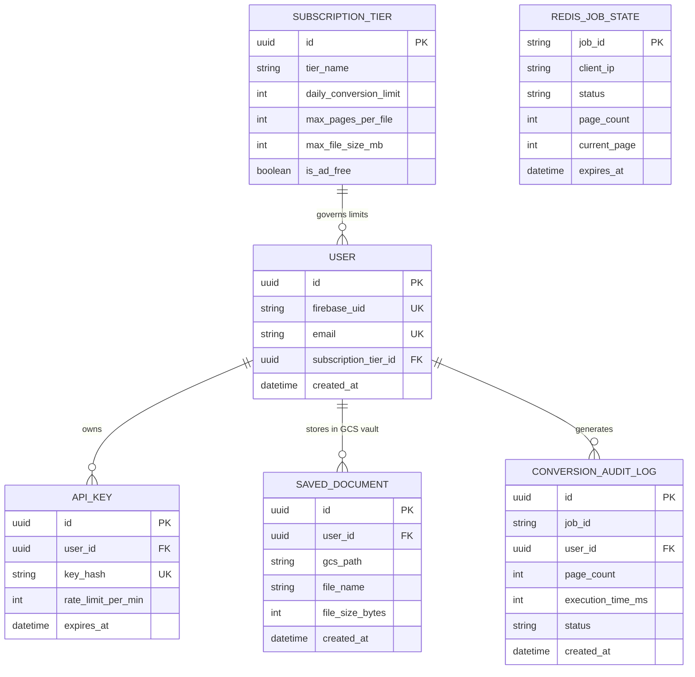

# Data Model & State Expansion: freeOCR.me

> **Stage:** 6 — Data Model & State  
> **Persona:** Principal Data Engineer  
> **Approved:** [x] approved  
> **Reads from:** [`01-product-brief.md`](file:///e:/Non_Office/Dev_Space/vibe_skool/freeOcr/product-specs/01-product-brief.md), [`02-architecture.md`](file:///e:/Non_Office/Dev_Space/vibe_skool/freeOcr/product-specs/02-architecture.md), [`04-feature-stories.md`](file:///e:/Non_Office/Dev_Space/vibe_skool/freeOcr/product-specs/04-feature-stories.md), [`04b-mvp-scope.md`](file:///e:/Non_Office/Dev_Space/vibe_skool/freeOcr/product-specs/04b-mvp-scope.md)  
> **Last Updated:** 2026-08-23  

---

## Dual-Layer Data Architecture

**freeOCR.me** operates on a **Dual-Layer Data Architecture**:

1. **Transient Memory Layer (MVP Production Runtime - DB-Disabled / DB-Light):** In MVP production, there are no persistent user accounts or saved files. All active conversion job states, IP rate-limiting counters, and rewarded ad session passes are managed in **Redis** with automated TTL expiration.
2. **Persistent Relational Schema (SQLAlchemy + PostgreSQL / SQLite `dev.db` - Day-1 Readiness):** In local development, full SQLAlchemy models and Alembic database migrations are built and unit-tested from Day 1. When **Firebase Auth**, **SafePay(https://getsafepay.pk/) for Paid Subscriptions**, and **GCP Cloud Storage User Vaults** launch Post-MVP, deploying **GCP Cloud SQL (PostgreSQL 16)** requires zero backend ORM code refactoring.

---

## Entity Relationship Diagram (Post-MVP Schema Baseline)



---

## Data Models

### 1. Redis Transient Memory Models (MVP Production)

#### `job:{job_id}` (Redis Hash)
| Field | Type | Description |
|-------|------|-------------|
| `job_id` | string (UUID) | Primary Key / Unique OCR Conversion Identifier |
| `client_ip` | string | Hashed client IP address for rate limiting |
| `status` | string | Current job status (`QUEUED`, `PROCESSING`, `COMPLETED`, `FAILED`, `PURGED`) |
| `layout_complexity` | string | Document layout classification (`SIMPLE` or `COMPLEX`) |
| `target_engine` | string | Target OCR engine (`OCRmyPDF` for CPU or `Baidu_Unlimited_OCR` for GPU) |
| `queue_name` | string | Target Redis queue (`ocr:queue:cpu` or `ocr:queue:gpu`) |
| `cold_start_active` | boolean | `true` if worker was cold-started upon job receipt |
| `total_pages` | integer | Total pages in PDF |
| `current_page` | integer | Current page undergoing processing |
| `output_pdf_token` | string | Ephemeral RAM disk output reference token |
| `created_at` | timestamp (ISO 8601) | Job creation timestamp |
| `expires_at` | timestamp (ISO 8601) | 24-hour output download link expiration timestamp |

*TTL Policy:* Redis key expires automatically in **86,400 seconds (24 hours)**.

#### `rate_limit:simple:{client_ip}` and `rate_limit:complex:{client_ip}` (Redis Counters)
| Field | Type | Description |
|-------|------|-------------|
| `simple_count` | integer | Total simple layout conversions in current 5-hour window (default limit 20) |
| `complex_count` | integer | Total complex AI layout conversions in current 5-hour window (default limit 5) |

*TTL Policy:* Keys expire in **18,000 seconds (5 hours)**.

#### `ad_pass:{client_ip}` (Redis Hash / JSON Token)
| Field | Type | Description |
|-------|------|-------------|
| `ads_watched_count` | integer | Total rewarded video ads watched in current session |
| `boosted_max_pages` | integer | Active allowed page count limit (`BASE_MAX_PAGES + (ads_watched_count * BOOST_PER_AD_PAGES)`) |
| `boosted_max_file_mb` | integer | Active allowed file size limit in MB (`BASE_MAX_FILE_MB + (ads_watched_count * BOOST_PER_AD_MB)`) |
| `last_ad_watched_at` | timestamp | Timestamp when most recent 15-second rewarded ad was completed |

*TTL Policy:* Redis key expires in **`AD_BOOST_TTL_SECONDS` (3,600s / 60 minutes)**. **Reset-on-Stack Expiry Policy:** Every time a user completes an ad reward to stack limits, the 60-minute TTL countdown timer resets to 60 minutes from the timestamp of the latest ad watched (`EXPIRE ad_pass:{ip} 3600`).  
*Runtime Configuration:* Single canonical global config is loaded dynamically from `src/backend/app/app_limits_config.json`.


---

### 2. SQLAlchemy ORM Models (Day-1 Dev Schema for Post-MVP GCP Cloud SQL)

#### `User` (`users` table)
| Field | Type | Required | Indexed | Notes |
|-------|------|----------|---------|-------|
| `id` | UUID | ✅ | ✅ (PK) | Primary Key |
| `firebase_uid` | VARCHAR(128) | ✅ | ✅ (UK) | Firebase Authentication Unique Identifier |
| `email` | VARCHAR(255) | ✅ | ✅ (UK) | User email address |
| `subscription_tier_id` | UUID | ✅ | ✅ (FK) | Foreign Key -> `subscription_tiers.id` |
| `created_at` | TIMESTAMPTZ | ✅ | | Account creation timestamp |
| `updated_at` | TIMESTAMPTZ | ✅ | | Auto-updated timestamp |

#### `SubscriptionTier` (`subscription_tiers` table)
| Field | Type | Required | Indexed | Notes |
|-------|------|----------|---------|-------|
| `id` | UUID | ✅ | ✅ (PK) | Primary Key |
| `tier_name` | VARCHAR(50) | ✅ | ✅ (UK) | `Free`, `Pro_Monthly`, `Enterprise_API` |
| `daily_conversion_limit` | INTEGER | ✅ | | Daily conversion cap |
| `max_pages_per_file` | INTEGER | ✅ | | Max pages allowed per PDF upload |
| `max_file_size_mb` | INTEGER | ✅ | | Max file size in megabytes |
| `is_ad_free` | BOOLEAN | ✅ | | If `True`, suppresses all display & rewarded ads |

#### `SavedDocument` (`saved_documents` table - Post-MVP Paid GCS Vault)
| Field | Type | Required | Indexed | Notes |
|-------|------|----------|---------|-------|
| `id` | UUID | ✅ | ✅ (PK) | Primary Key |
| `user_id` | UUID | ✅ | ✅ (FK) | Foreign Key -> `users.id` |
| `gcs_path` | VARCHAR(512) | ✅ | | Encrypted GCP Cloud Storage object path |
| `file_name` | VARCHAR(255) | ✅ | | Original document filename |
| `file_size_bytes` | BIGINT | ✅ | | File size in bytes |
| `created_at` | TIMESTAMPTZ | ✅ | ✅ | Creation timestamp |

---

## OCR Conversion Job State Machine

```
   [SUBMITTED]
        │
    (validate)
        │
        ▼
    [QUEUED] ──► (pop by Celery GPU Worker)
        │
        ▼
   [PROCESSING] ──► (emit SSE updates: "Page 3 of 8...")
        │
   ┌────┴──────────────────────────┐
   │ (OCR Success)                 │ (OCR Error / Corrupted)
   ▼                               ▼
[COMPLETED]                    [FAILED]
   │                               │
 (download or send email)       (auto-repair retry)
   │                               │
   ▼                               ▼
[PURGED] ◄── (instant tmpfs unlink) ┘
```

### Transition Table

| From State | Event | To State | Guard Condition | Side Effects |
|-----------|-------|---------|----------------|--------------|
| `SUBMITTED` | `validate_request` | `QUEUED` | File format valid, within page cap & Redis rate limits | Write job metadata to Redis queue |
| `QUEUED` | `worker_pickup` | `PROCESSING` | Worker thread available | Write input PDF to Linux `tmpfs` RAM disk |
| `PROCESSING` | `page_ocr_success` | `PROCESSING` | Page inference completed | Emit SSE progress event to client |
| `PROCESSING` | `ocr_complete` | `COMPLETED` | All pages converted | Render output PDF/Text to `tmpfs`; generate 24h download token |
| `PROCESSING` | `ocr_failure` | `FAILED` | Exception in PaddleOCR-VL 1.6 worker | Attempt `pdfcpu`/`qpdf` repair fallback |
| `COMPLETED` | `direct_download` | `PURGED` | User clicks direct download button | `os.remove()` input PDF immediately from `tmpfs` RAM disk |
| `COMPLETED` | `send_email` | `PURGED` | User clicks "Send Email" button | Dispatch email with 24h download links; `os.remove()` input PDF immediately |
| `COMPLETED` | `watchdog_tick` | `PURGED` | File age > 60 seconds in RAM disk | 60s Watchdog cleaner unlinks orphan files |

---

## API Resource Map (FastAPI Endpoints)

| Resource | HTTP Method | Endpoint | Auth Required | Rate Limited | Notes |
|----------|-------------|----------|---------------|--------------|-------|
| **Convert PDF** | `POST` | `/api/v1/ocr/convert` | No (MVP) | Yes (Redis) | Accepts PDF/image binary stream, enqueues OCR task |
| **Job Progress SSE** | `GET` | `/api/v1/jobs/{job_id}/events` | No (MVP) | No | Server-Sent Events stream emitting live page progress |
| **Download PDF** | `GET` | `/api/v1/jobs/{job_id}/download/pdf` | No (MVP) | Yes | Downloads searchable PDF; triggers instant input file purge |
| **Download Text** | `GET` | `/api/v1/jobs/{job_id}/download/txt` | No (MVP) | Yes | Downloads plain `.txt` file |
| **Download Markdown**| `GET` | `/api/v1/jobs/{job_id}/download/md` | No (MVP) | Yes | Downloads formatted `.md` file |
| **Send Email Links**| `POST` | `/api/v1/ocr/email-links` | No (MVP) | Yes | Emails 24h download links & triggers instant input file purge |
| **Rewarded Ad Callback**| `POST` | `/api/v1/ads/rewarded-callback`| No (MVP) | Yes | Validates ad completion token & atomically increments stackable session limit boost (+15 pages / +20MB, runtime configurable) |
| **Decrypt PDF** | `POST` | `/api/v1/ocr/decrypt` | No (MVP) | Yes | Accepts password for encrypted PDFs & resumes OCR |
| **Get App Config** | `GET` | `/api/v1/config` | No | No | Returns unified JSON config (base limits, boost step sizes, ad rotation intervals) for zero-redeploy runtime execution |
| **Health Check** | `GET` | `/healthz` | No | No | GCP Cloud Run load balancer health check probe |
