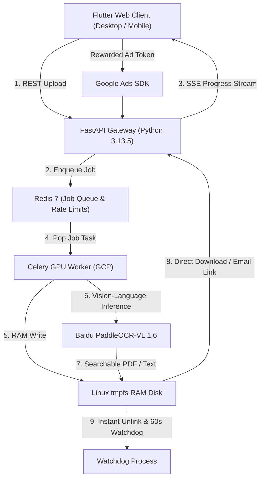

# Master Product Requirements Document
# freeOCR.me — Version 1.0

> **Document Type:** Master PRD  
> **Stage:** 8 — Final Synthesis  
> **Persona:** Chief of Product  
> **Approved:** [x] approved  
> **Last Updated:** 2026-08-23  
> **Reads from:** [`01`](file:///e:/Non_Office/Dev_Space/vibe_skool/freeOcr/product-specs/01-product-brief.md) · [`01b`](file:///e:/Non_Office/Dev_Space/vibe_skool/freeOcr/product-specs/01b-tech-stack.md) · [`02`](file:///e:/Non_Office/Dev_Space/vibe_skool/freeOcr/product-specs/02-architecture.md) · [`03`](file:///e:/Non_Office/Dev_Space/vibe_skool/freeOcr/product-specs/03-user-journeys.md) · [`04`](file:///e:/Non_Office/Dev_Space/vibe_skool/freeOcr/product-specs/04-feature-stories.md) · [`04b`](file:///e:/Non_Office/Dev_Space/vibe_skool/freeOcr/product-specs/04b-mvp-scope.md) · [`05`](file:///e:/Non_Office/Dev_Space/vibe_skool/freeOcr/product-specs/05-style-guide.md) · [`06`](file:///e:/Non_Office/Dev_Space/vibe_skool/freeOcr/product-specs/06-data-model.md) · [`06a`](file:///e:/Non_Office/Dev_Space/vibe_skool/freeOcr/product-specs/06a-use-case-tickets.md) · [`07`](file:///e:/Non_Office/Dev_Space/vibe_skool/freeOcr/product-specs/07-roadmap.md) · [`07a`](file:///e:/Non_Office/Dev_Space/vibe_skool/freeOcr/product-specs/07a-engineering-charter.md) · [`07b`](file:///e:/Non_Office/Dev_Space/vibe_skool/freeOcr/product-specs/07b-integrity-review.md)  
>
> **Intended Audience:** Founders, Lead Engineers, AI Coding Agents, QA Engineers, Designers, Investors.

---

## 1. Executive Summary

### 1.1 Product Vision
**freeOCR.me** is a fast, privacy-first web utility platform that transforms scanned PDFs and images into searchable PDFs and clean selectable text. Powered by **Baidu PaddleOCR-VL 1.6 (0.9B)** on GCP backend GPU workers, it guarantees 100% original visual layout preservation via an invisible text layer overlay and operates under a strict **zero-retention privacy policy** using Linux `tmpfs` RAM disks with instant file unlinking.

### 1.2 Core Hypothesis
Users actively seek a fast, highly accurate, layout-preserving AI OCR web utility that guarantees zero data retention, and will happily engage with an ad-supported model (including watching 15-second rewarded ads for stackable limit boosts that increment file size and page caps per watched ad) rather than hitting aggressive paywalls or sacrificing privacy.

### 1.3 Success Definition
| Time Horizon | Success Looks Like | Key Metric |
|-------------|-------------------|-----------|
| **MVP Launch** | Clean, fast 10-second conversion loop with zero P0 bugs | 5,000 monthly conversions |
| **3 Months Post-Launch** | Strong ad engagement & repeat utility visits | 50,000 monthly conversions; 15% rewarded ad engagement |
| **12 Months** | Post-MVP SaaS expansion (SafePay subscriptions & API keys) | 300,000 monthly conversions; 2.5% free-to-paid upgrade rate |

---

## 2. Problem & Market

### 2.1 Problem Statement
Users need to extract readable, searchable text from scanned PDFs, receipts, notes, and contracts every day. Current free web tools fall short: they produce inaccurate text output, mangle original document formatting, impose tight page/file size caps behind paywalls, and force users to trust unknown servers with confidential contracts or invoices.

### 2.2 Target Users
- **Students & Academics:** Converting scanned textbooks, research papers, and handwritten lecture notes.
- **Legal Professionals:** Converting scanned contracts and court filings under a strict zero-retention confidentiality guarantee.
- **Accountants & Admins:** Converting scanned receipts and invoices while preserving table layouts.
- **General Web Users:** One-off document conversions without registration barriers.

### 2.3 Key Differentiators
- **Superior AI Accuracy:** Baidu PaddleOCR-VL 1.6 (0.9B) vision-language inference engine.
- **100% Visual Layout Fidelity:** Invisible text layer overlay over original high-res scan background.
- **Zero-Retention Ephemeral Privacy:** Files processed in Linux `tmpfs` RAM disk; input files purged immediately upon download or "Send Email" click.
- **Stackable Rewarded Ad Limit Boosts:** Watching 15-second video ads incrementally increases file size (+20MB) and page count (+15 pages) caps indefinitely per ad watched.
- **Runtime Configurable Parameters:** Base limits, boost increments per ad, and session TTLs are fully runtime configurable via environment settings without code changes.

---

## 3. Technology & Architecture

### 3.1 Tech Stack Summary
- **Frontend UI:** Flutter 3.x (Flutter Web Desktop-first MVP → Mobile post-MVP → Desktop/CLI at scale).
- **Backend API:** Python 3.13.5 + FastAPI (ASGI).
- **AI OCR Core:** Baidu PaddleOCR-VL 1.6 (0.9B) on GCP GPU workers.
- **Queue & Messaging:** Redis 7 (Job queue, IP rate limiting, 60-min ad passes, SSE stream broker).
- **Storage:** Linux `tmpfs` RAM disk (`/tmp`) for free users; opt-in GCP Cloud Storage (GCS) for post-MVP paid users.
- **Post-MVP Database & Auth:** Firebase Auth + SafePay Subscriptions + GCP Cloud SQL (PostgreSQL 16) via SQLAlchemy ORM (DB-Light in MVP).

### 3.2 System Architecture Diagram

---

## 4. User Experience & Journeys

### 4.1 Key Journeys
1. **Journey 1 (The 10-Second Aha Moment):** Zero-clutter hero dropzone → SSE live progress (`Page 3 of 8... 37%`) → Side-by-side split preview (Original Scan vs Selectable OCR Text) → 1-click downloads (`.pdf`, `.txt`, `.md`).
2. **Journey 2 (Stackable Rewarded Ad Limit Boosts):** Over-limit file upload -> Rewarded Ad Modal -> Watch 15s ad -> Indefinitely stackable limit increments (+20MB / +15 pages per ad, runtime configurable) stored in Redis session pass (`ad_pass:{client_ip}`).
3. **Journey 3 (Email Link Delivery & Instant Purge):** Optional email input field for receiving 24h download links -> Input file unlinked from RAM disk *immediately* when "Send Email" is clicked. Expiration link renders friendly page: *"Link expired at HH:MM local time"*.
4. **Journey 4 (Encrypted & Corrupted PDF Recovery):** Password-in-Place decryption prompt for encrypted PDFs; automated repair fallback (`qpdf` / `pdfcpu` / `ghostscript`) for corrupted files.

### 4.2 Ad Rotation Policy
Display ad slots on Landing and Download pages automatically rotate every **35 seconds** while the page tab remains active.

---

## 5. Feature Requirements & MVP Backlog

### 5.1 MVP Feature Set (16 Backlog Tickets)

#### Epic 0: Foundation & Environment Setup
- **`UC-000a`:** Monorepo Project Structure & Dependency Initialization
- **`UC-000b`:** Local Development Pipeline, Redis & Dev Database Setup
- **`UC-000c`:** GitHub Actions CI/CD Pipeline & Graphify MCP Integration

#### Epic 1–4: Core Application & Monetization
- **`UC-001`:** Drag & Drop PDF Upload & File Validation
- **`UC-002`:** Real-Time SSE Progress Streaming
- **`UC-003`:** Baidu PaddleOCR-VL 1.6 Worker Execution & `tmpfs` RAM Disk Management
- **`UC-004`:** Searchable PDF Composition Engine (Invisible Layer Overlay)
- **`UC-005`:** Interactive Side-by-Side Split Preview Viewer
- **`UC-006`:** 1-Click Multi-Format Direct Downloads (`.pdf`, `.txt`, `.md`)
- **`UC-007`:** Email Download Link Delivery & Immediate Input File Purging
- **`UC-008`:** 24-Hour Expiration TTL & Local Time Expired Link Handler
- **`UC-009`:** 35-Second AdSense Display Ad Banner Rotation Timer
- **`UC-010`:** Limit Exceeded Detection & Rewarded Video Ad Modal Trigger
- **`UC-011`:** Rewarded Ad Callback & Stackable Session Limit Boost Pass (Runtime Configurable)
- **`UC-012`:** Password-in-Place Encrypted PDF Decryption
- **`UC-013`:** Corrupted PDF Auto-Repair & 60s Watchdog RAM Disk Cleaner

---

## 6. Design System Tokens (Material 3 & Apple Motion)

- **Brand Personality:** Fast, Trustworthy, Invitingly Simple.
- **Flutter Material 3 ColorScheme Tokens:**
  - `primary`: Electric Indigo (`#4F46E5` / Dark `#818CF8`)
  - `secondary`: Cyber Blue (`#3B82F6` / Dark `#60A5FA`)
  - `tertiary`: Emerald Green (`#10B981` / Dark `#34D399`)
  - `surface`: Slate Light (`#F8FAFC`) / Slate Dark (`#0F172A`)
  - `surfaceContainer`: White (`#FFFFFF`) / Slate Card (`#1E293B`)
- **Typography:** **Inter** (UI font) + **JetBrains Mono** (Monospace OCR code preview).
- **Apple Motion Physics:** Instant pointer-down press response (`transform: scale(0.97)`), critically damped spring physics (`damping: 1.0`, `response: 0.4s`), frosted glass translucent materials (`backdrop-filter blur 20px`).

---

## 7. Data Model & State Machine

- **MVP Production Runtime:** DB-Light / DB-Disabled. Managed entirely in Redis (`job:{id}`, `ip_limit:{ip}`, `ad_pass:{ip}`).
- **Day-1 Dev Schema:** SQLAlchemy ORM models (`users`, `subscription_tiers`, `api_keys`, `saved_documents`, `conversion_audit_logs`) pre-built in `SQLite dev.db` for Post-MVP GCP Cloud SQL activation.
- **Job State Machine:**
  `SUBMITTED` ──► `QUEUED` ──► `PROCESSING` ──► `COMPLETED` ──► `PURGED` (via direct download, email link click, or 60s watchdog cleaner).

---

## 8. Engineering Governance

- **Canonical Rules File:** [`.agents/AGENTS.md`](file:///e:/Non_Office/Dev_Space/vibe_skool/freeOcr/.agents/AGENTS.md)
- **TDD Mandate:** Automated unit/integration tests in `./src/tests/unit/` or `./src/tests/integration/` MUST be created before writing implementation code for any ticket.
- **Graphify MCP Knowledge Graph:** Incrementally updated during ticket execution to maintain symbol graph relationships and reduce agent context load.
- **Git Branching Protocol:** `main` (production), `dev` (staging), `sprint/sprint-XX` or `feature/UC-XXX` for active ticket development.
- **Master Tracker:** [`trackers/master-tracker.md`](file:///e:/Non_Office/Dev_Space/vibe_skool/freeOcr/trackers/master-tracker.md)

---

## Appendix — Artifact Index

| Artifact File | Description | Status |
|---------------|-------------|--------|
| [`00-carry-forward-flags.md`](file:///e:/Non_Office/Dev_Space/vibe_skool/freeOcr/product-specs/00-carry-forward-flags.md) | Single consolidated decision, assumption, and risk log | ✅ Approved |
| [`01-product-brief.md`](file:///e:/Non_Office/Dev_Space/vibe_skool/freeOcr/product-specs/01-product-brief.md) | Product vision, target users, insight, differentiators | ✅ Approved |
| [`01b-tech-stack.md`](file:///e:/Non_Office/Dev_Space/vibe_skool/freeOcr/product-specs/01b-tech-stack.md) | 28-layer technology stack assessment & choices | ✅ Approved |
| [`02-architecture.md`](file:///e:/Non_Office/Dev_Space/vibe_skool/freeOcr/product-specs/02-architecture.md) | System architecture, scale profile, layout overlay engine | ✅ Approved |
| [`03-user-journeys.md`](file:///e:/Non_Office/Dev_Space/vibe_skool/freeOcr/product-specs/03-user-journeys.md) | Interaction flows, emotional maps, screen inventory | ✅ Approved |
| [`04-feature-stories.md`](file:///e:/Non_Office/Dev_Space/vibe_skool/freeOcr/product-specs/04-feature-stories.md) | Epics, user stories, acceptance criteria | ✅ Approved |
| [`04b-mvp-scope.md`](file:///e:/Non_Office/Dev_Space/vibe_skool/freeOcr/product-specs/04b-mvp-scope.md) | MVP scoping gate, minimum value loop, build sequence | ✅ Approved |
| [`05-style-guide.md`](file:///e:/Non_Office/Dev_Space/vibe_skool/freeOcr/product-specs/05-style-guide.md) | Material 3 design tokens, typography, Apple motion | ✅ Approved |
| [`06-data-model.md`](file:///e:/Non_Office/Dev_Space/vibe_skool/freeOcr/product-specs/06-data-model.md) | Dual-layer data architecture, Redis & SQLAlchemy ORM | ✅ Approved |
| [`06a-use-case-tickets.md`](file:///e:/Non_Office/Dev_Space/vibe_skool/freeOcr/product-specs/06a-use-case-tickets.md) | 13 implementation-ready tickets (`UC-001`–`UC-013`) | ✅ Approved |
| [`07-roadmap.md`](file:///e:/Non_Office/Dev_Space/vibe_skool/freeOcr/product-specs/07-roadmap.md) | Phase roadmap, sprint ticket assignments, risk register | ✅ Approved |
| [`07a-engineering-charter.md`](file:///e:/Non_Office/Dev_Space/vibe_skool/freeOcr/product-specs/07a-engineering-charter.md) | Engineering charter & tracker generator | ✅ Approved |
| [`07b-integrity-review.md`](file:///e:/Non_Office/Dev_Space/vibe_skool/freeOcr/product-specs/07b-integrity-review.md) | Autonomous specification integrity audit report | ✅ Approved |
| [`08-master-prd.md`](file:///e:/Non_Office/Dev_Space/vibe_skool/freeOcr/product-specs/08-master-prd.md) | **Master Product Requirements Document** | ✅ Approved |
