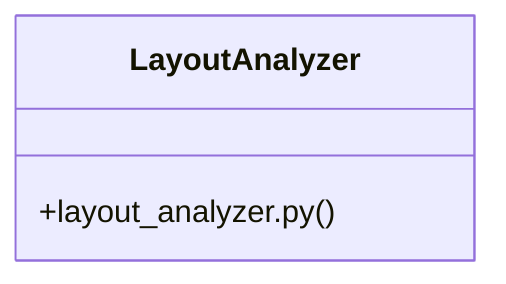

# Community 0

> 20 nodes · cohesion 0.18

## Key Concepts

- [.get()](file:///E:/Non_Office/Dev_Space/vibe_skool/freeOcr/src/backend/app/redis_client.py#L65) (24 connections)
- [convert_document()](file:///E:/Non_Office/Dev_Space/vibe_skool/freeOcr/src/backend/app/api/v1/endpoints/ocr.py#L140) (9 connections)
- [rewarded_ad_callback()](file:///E:/Non_Office/Dev_Space/vibe_skool/freeOcr/src/backend/app/api/v1/endpoints/ocr.py#L301) (8 connections)
- [ocr.py](file:///E:/Non_Office/Dev_Space/vibe_skool/freeOcr/src/backend/app/api/v1/endpoints/ocr.py#L1) (7 connections)
- [LayoutAnalyzer](file:///E:/Non_Office/Dev_Space/vibe_skool/freeOcr/src/backend/app/services/layout_analyzer.py#L12) (6 connections)
- [email_download_links()](file:///E:/Non_Office/Dev_Space/vibe_skool/freeOcr/src/backend/app/api/v1/endpoints/ocr.py#L48) (6 connections)
- [get_ad_pass_metadata()](file:///E:/Non_Office/Dev_Space/vibe_skool/freeOcr/src/backend/app/redis_client.py#L142) (6 connections)
- [_get_session_keys()](file:///E:/Non_Office/Dev_Space/vibe_skool/freeOcr/src/backend/app/api/v1/endpoints/ocr.py#L37) (5 connections)
- [send_download_links_email()](file:///E:/Non_Office/Dev_Space/vibe_skool/freeOcr/src/backend/app/services/email_service.py#L20) (4 connections)
- [_get_normalized_client_ip()](file:///E:/Non_Office/Dev_Space/vibe_skool/freeOcr/src/backend/app/api/v1/endpoints/ocr.py#L26) (4 connections)
- [layout_analyzer.py](file:///E:/Non_Office/Dev_Space/vibe_skool/freeOcr/src/backend/app/services/layout_analyzer.py#L1) (3 connections)
- [analyze_pdf_bytes()](file:///E:/Non_Office/Dev_Space/vibe_skool/freeOcr/src/backend/app/services/layout_analyzer.py#L14) (3 connections)
- [job_events_stream()](file:///E:/Non_Office/Dev_Space/vibe_skool/freeOcr/src/backend/app/api/v1/endpoints/ocr.py#L359) (2 connections)
- [Endpoint for uploading PDF/image files for OCR conversion.     Validates extens](file:///E:/Non_Office/Dev_Space/vibe_skool/freeOcr/src/backend/app/api/v1/endpoints/ocr.py#L146) (2 connections)
- [Validates rewarded ad view and stacks user limits (+50MB, +15 pages).     Reset](file:///E:/Non_Office/Dev_Space/vibe_skool/freeOcr/src/backend/app/api/v1/endpoints/ocr.py#L302) (2 connections)
- [Server-Sent Events (SSE) stream for real-time progress updates on a job.     Su](file:///E:/Non_Office/Dev_Space/vibe_skool/freeOcr/src/backend/app/api/v1/endpoints/ocr.py#L360) (2 connections)
- [Validates email, checks job completion, instantly purges original input file](file:///E:/Non_Office/Dev_Space/vibe_skool/freeOcr/src/backend/app/api/v1/endpoints/ocr.py#L49) (2 connections)
- [Dispatches 24-hour expiring download links to the target email.     Uses Resend](file:///E:/Non_Office/Dev_Space/vibe_skool/freeOcr/src/backend/app/services/email_service.py#L21) (1 connections)
- [Document Layout and Complexity Pre-Processing Analyzer.  Analyzes uploaded PDF](file:///E:/Non_Office/Dev_Space/vibe_skool/freeOcr/src/backend/app/services/layout_analyzer.py#L1) (1 connections)
- [Retrieves ad pass payload dict from Redis, falling back to in-memory store.](file:///E:/Non_Office/Dev_Space/vibe_skool/freeOcr/src/backend/app/redis_client.py#L143) (1 connections)

## Class Diagram

## Relationships

- No strong cross-community connections detected

## Source Files

- [E:\Non_Office\Dev_Space\vibe_skool\freeOcr\src\backend\app\api\v1\endpoints\ocr.py](file:///E:/Non_Office/Dev_Space/vibe_skool/freeOcr/src/backend/app/api/v1/endpoints/ocr.py)
- [E:\Non_Office\Dev_Space\vibe_skool\freeOcr\src\backend\app\redis_client.py](file:///E:/Non_Office/Dev_Space/vibe_skool/freeOcr/src/backend/app/redis_client.py)
- [E:\Non_Office\Dev_Space\vibe_skool\freeOcr\src\backend\app\services\email_service.py](file:///E:/Non_Office/Dev_Space/vibe_skool/freeOcr/src/backend/app/services/email_service.py)
- [E:\Non_Office\Dev_Space\vibe_skool\freeOcr\src\backend\app\services\layout_analyzer.py](file:///E:/Non_Office/Dev_Space/vibe_skool/freeOcr/src/backend/app/services/layout_analyzer.py)

## Audit Trail

- EXTRACTED: 48 (49%)
- INFERRED: 50 (51%)
- AMBIGUOUS: 0 (0%)

---

*Part of the graphify knowledge wiki. See [[index]] to navigate.*