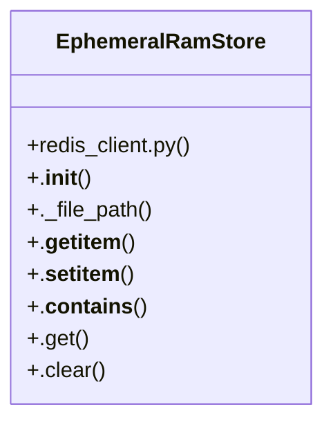

# Community 1

> 18 nodes · cohesion 0.16

## Key Concepts

- [EphemeralRamStore](file:///E:/Non_Office/Dev_Space/vibe_skool/freeOcr/src/backend/app/redis_client.py#L9) (18 connections)
- [jobs.py](file:///E:/Non_Office/Dev_Space/vibe_skool/freeOcr/src/backend/app/api/v1/endpoints/jobs.py#L1) (6 connections)
- [batch_download_zip()](file:///E:/Non_Office/Dev_Space/vibe_skool/freeOcr/src/backend/app/api/v1/endpoints/jobs.py#L344) (5 connections)
- [get_job_preview()](file:///E:/Non_Office/Dev_Space/vibe_skool/freeOcr/src/backend/app/api/v1/endpoints/jobs.py#L179) (4 connections)
- [get_job_status()](file:///E:/Non_Office/Dev_Space/vibe_skool/freeOcr/src/backend/app/api/v1/endpoints/jobs.py#L22) (4 connections)
- [stream_job_events()](file:///E:/Non_Office/Dev_Space/vibe_skool/freeOcr/src/backend/app/api/v1/endpoints/jobs.py#L56) (4 connections)
- [._file_path()](file:///E:/Non_Office/Dev_Space/vibe_skool/freeOcr/src/backend/app/redis_client.py#L20) (4 connections)
- [.__getitem__()](file:///E:/Non_Office/Dev_Space/vibe_skool/freeOcr/src/backend/app/redis_client.py#L25) (4 connections)
- [.__contains__()](file:///E:/Non_Office/Dev_Space/vibe_skool/freeOcr/src/backend/app/redis_client.py#L52) (3 connections)
- [.__setitem__()](file:///E:/Non_Office/Dev_Space/vibe_skool/freeOcr/src/backend/app/redis_client.py#L41) (3 connections)
- [Returns extracted text blocks and page layout metadata for an OCR job.     Retu](file:///E:/Non_Office/Dev_Space/vibe_skool/freeOcr/src/backend/app/api/v1/endpoints/jobs.py#L180) (2 connections)
- [Returns job status and progress for polling or verification.](file:///E:/Non_Office/Dev_Space/vibe_skool/freeOcr/src/backend/app/api/v1/endpoints/jobs.py#L23) (2 connections)
- [Streams a single ZIP archive containing all completed documents in the batch.](file:///E:/Non_Office/Dev_Space/vibe_skool/freeOcr/src/backend/app/api/v1/endpoints/jobs.py#L348) (2 connections)
- [Real-time Server-Sent Events (SSE) progress streaming endpoint.     Subscribes](file:///E:/Non_Office/Dev_Space/vibe_skool/freeOcr/src/backend/app/api/v1/endpoints/jobs.py#L57) (2 connections)
- [.__init__()](file:///E:/Non_Office/Dev_Space/vibe_skool/freeOcr/src/backend/app/redis_client.py#L14) (2 connections)
- **dict** (1 connections)
- [.clear()](file:///E:/Non_Office/Dev_Space/vibe_skool/freeOcr/src/backend/app/redis_client.py#L71) (1 connections)
- [In-memory dict backed by Linux tmpfs / ephemeral RAM disk (/tmp or RAM_DISK_PATH](file:///E:/Non_Office/Dev_Space/vibe_skool/freeOcr/src/backend/app/redis_client.py#L10) (1 connections)

## Class Diagram

## Relationships

- No strong cross-community connections detected

## Source Files

- [E:\Non_Office\Dev_Space\vibe_skool\freeOcr\src\backend\app\api\v1\endpoints\jobs.py](file:///E:/Non_Office/Dev_Space/vibe_skool/freeOcr/src/backend/app/api/v1/endpoints/jobs.py)
- [E:\Non_Office\Dev_Space\vibe_skool\freeOcr\src\backend\app\redis_client.py](file:///E:/Non_Office/Dev_Space/vibe_skool/freeOcr/src/backend/app/redis_client.py)

## Audit Trail

- EXTRACTED: 47 (69%)
- INFERRED: 21 (31%)
- AMBIGUOUS: 0 (0%)

---

*Part of the graphify knowledge wiki. See [[index]] to navigate.*