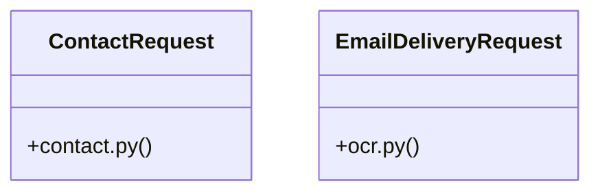

# Community 7

> 9 nodes · cohesion 0.22

## Key Concepts

- [validate_email_address()](file:///E:/Non_Office/Dev_Space/vibe_skool/freeOcr/src/backend/app/services/email_service.py#L11) (4 connections)
- [submit_contact_form()](file:///E:/Non_Office/Dev_Space/vibe_skool/freeOcr/src/backend/app/api/v1/endpoints/contact.py#L20) (3 connections)
- [EmailDeliveryRequest](file:///E:/Non_Office/Dev_Space/vibe_skool/freeOcr/src/backend/app/api/v1/endpoints/ocr.py#L21) (3 connections)
- **BaseModel** (2 connections)
- [ContactRequest](file:///E:/Non_Office/Dev_Space/vibe_skool/freeOcr/src/backend/app/api/v1/endpoints/contact.py#L11) (2 connections)
- [contact.py](file:///E:/Non_Office/Dev_Space/vibe_skool/freeOcr/src/backend/app/api/v1/endpoints/contact.py#L1) (2 connections)
- [email_service.py](file:///E:/Non_Office/Dev_Space/vibe_skool/freeOcr/src/backend/app/services/email_service.py#L1) (2 connections)
- [Submits a contact inquiry. Validates input and logs contact submission.](file:///E:/Non_Office/Dev_Space/vibe_skool/freeOcr/src/backend/app/api/v1/endpoints/contact.py#L21) (1 connections)
- [Validates email format using regex.](file:///E:/Non_Office/Dev_Space/vibe_skool/freeOcr/src/backend/app/services/email_service.py#L12) (1 connections)

## Class Diagram

## Relationships

- No strong cross-community connections detected

## Source Files

- [E:\Non_Office\Dev_Space\vibe_skool\freeOcr\src\backend\app\api\v1\endpoints\contact.py](file:///E:/Non_Office/Dev_Space/vibe_skool/freeOcr/src/backend/app/api/v1/endpoints/contact.py)
- [E:\Non_Office\Dev_Space\vibe_skool\freeOcr\src\backend\app\api\v1\endpoints\ocr.py](file:///E:/Non_Office/Dev_Space/vibe_skool/freeOcr/src/backend/app/api/v1/endpoints/ocr.py)
- [E:\Non_Office\Dev_Space\vibe_skool\freeOcr\src\backend\app\services\email_service.py](file:///E:/Non_Office/Dev_Space/vibe_skool/freeOcr/src/backend/app/services/email_service.py)

## Audit Trail

- EXTRACTED: 16 (80%)
- INFERRED: 4 (20%)
- AMBIGUOUS: 0 (0%)

---

*Part of the graphify knowledge wiki. See [[index]] to navigate.*