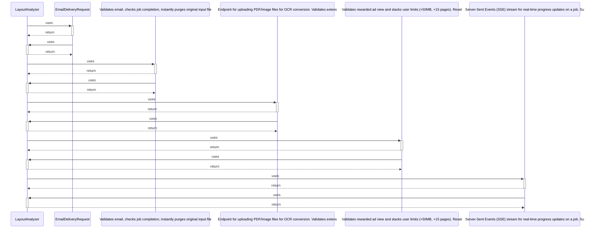

# LayoutAnalyzer

> God node · 6 connections · [E:\Non_Office\Dev_Space\vibe_skool\freeOcr\src\backend\app\services\layout_analyzer.py](file:///E:/Non_Office/Dev_Space/vibe_skool/freeOcr/src/backend/app/services/layout_analyzer.py#L12)

## Call Trace Diagram

## Connections by Relation

### contains
- [[layout_analyzer.py]] `EXTRACTED`

### uses
- [[EmailDeliveryRequest]] `INFERRED`
- [[Validates email, checks job completion, instantly purges original input file]] `INFERRED`
- [[Endpoint for uploading PDF/image files for OCR conversion.     Validates extens]] `INFERRED`
- [[Validates rewarded ad view and stacks user limits (+50MB, +15 pages).     Reset]] `INFERRED`
- [[Server-Sent Events (SSE) stream for real-time progress updates on a job.     Su]] `INFERRED`

---

*Part of the graphify knowledge wiki. See [[index]] to navigate.*