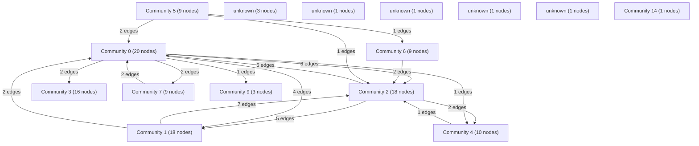

# Knowledge Graph Index

> Auto-generated by graphify. Start here — read community articles for context, then drill into god nodes for detail.

**120 nodes · 193 edges · 15 communities**

---

## System Architecture Flowchart

## Communities
(sorted by size, largest first)

- [[Community 0]] — 20 nodes
- [[Community 1]] — 18 nodes
- [[Community 2]] — 18 nodes
- [[Community 3]] — 16 nodes
- [[Community 4]] — 10 nodes
- [[Community 5]] — 9 nodes
- [[Community 6]] — 9 nodes
- [[Community 7]] — 9 nodes
- [[unknown]] — 3 nodes
- [[Community 9]] — 3 nodes
- [[unknown]] — 1 nodes
- [[unknown]] — 1 nodes
- [[unknown]] — 1 nodes
- [[unknown]] — 1 nodes
- [[Community 14]] — 1 nodes

## God Nodes
(most connected concepts — the load-bearing abstractions)

- [[get_redis_client()]] — 19 connections
- [[EphemeralRamStore]] — 18 connections
- [[convert_document()]] — 9 connections
- [[rewarded_ad_callback()]] — 8 connections
- [[process_ocr_job()]] — 8 connections
- [[get_searchable_pdf()]] — 7 connections
- [[load_canonical_config()]] — 6 connections
- [[get_ad_pass_metadata()]] — 6 connections
- [[email_download_links()]] — 6 connections
- [[LayoutAnalyzer]] — 6 connections

---

*Generated by [graphify](https://github.com/safishamsi/graphify)*