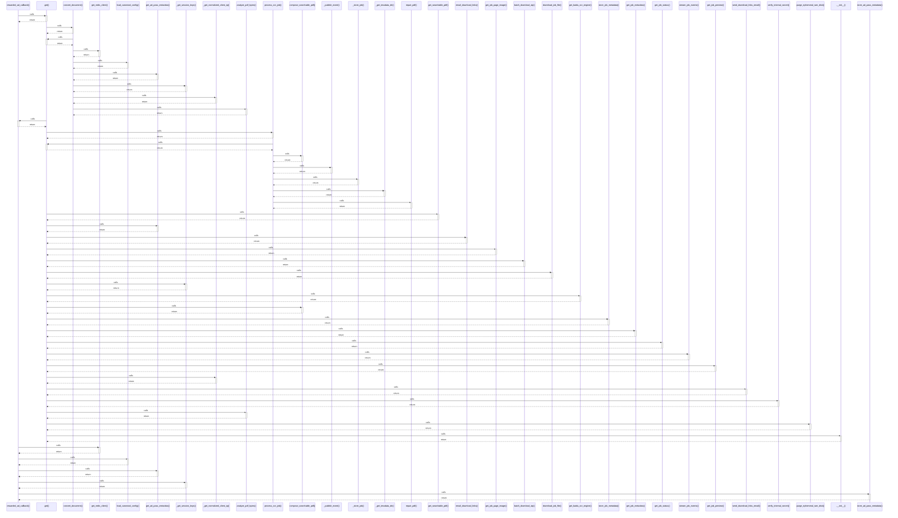

# rewarded_ad_callback()

> God node · 8 connections · [E:\Non_Office\Dev_Space\vibe_skool\freeOcr\src\backend\app\api\v1\endpoints\ocr.py](file:///E:/Non_Office/Dev_Space/vibe_skool/freeOcr/src/backend/app/api/v1/endpoints/ocr.py#L301)

## Call Trace Diagram

## Connections by Relation

### calls
- [[.get()]] `INFERRED`
- [[get_redis_client()]] `INFERRED`
- [[load_canonical_config()]] `INFERRED`
- [[get_ad_pass_metadata()]] `INFERRED`
- [[_get_session_keys()]] `EXTRACTED`
- [[store_ad_pass_metadata()]] `INFERRED`

### contains
- [[ocr.py]] `EXTRACTED`

### rationale_for
- [[Validates rewarded ad view and stacks user limits (+50MB, +15 pages).     Reset]] `EXTRACTED`

---

*Part of the graphify knowledge wiki. See [[index]] to navigate.*