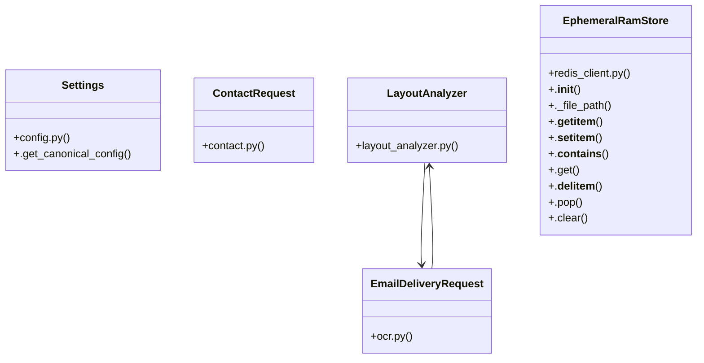

# Community 1

> 215 nodes · cohesion 0.02

## Key Concepts

- [.get()](file:///E:/Non_Office/Dev_Space/vibe_skool/freeOcr/src/backend/app/redis_client.py#L65) (116 connections)
- [EphemeralRamStore](file:///E:/Non_Office/Dev_Space/vibe_skool/freeOcr/src/backend/app/redis_client.py#L9) (28 connections)
- [get_redis_client()](file:///E:/Non_Office/Dev_Space/vibe_skool/freeOcr/src/backend/app/redis_client.py#L108) (24 connections)
- [.pop()](file:///E:/Non_Office/Dev_Space/vibe_skool/freeOcr/src/backend/app/redis_client.py#L81) (15 connections)
- [compose_searchable_pdf()](file:///E:/Non_Office/Dev_Space/vibe_skool/freeOcr/src/backend/app/services/pdf_composer.py#L16) (13 connections)
- [get_job_metadata()](file:///E:/Non_Office/Dev_Space/vibe_skool/freeOcr/src/backend/app/redis_client.py#L150) (13 connections)
- [redis_client.py](file:///E:/Non_Office/Dev_Space/vibe_skool/freeOcr/src/backend/app/redis_client.py#L1) (12 connections)
- [test_email_delivery.py](file:///E:/Non_Office/Dev_Space/vibe_skool/freeOcr/src/tests/test_email_delivery.py#L1) (12 connections)
- [get_searchable_pdf()](file:///E:/Non_Office/Dev_Space/vibe_skool/freeOcr/src/backend/app/services/pdf_composer.py#L128) (11 connections)
- [test_download_endpoints.py](file:///E:/Non_Office/Dev_Space/vibe_skool/freeOcr/src/tests/test_download_endpoints.py#L1) (10 connections)
- [LayoutAnalyzer](file:///E:/Non_Office/Dev_Space/vibe_skool/freeOcr/src/backend/app/services/layout_analyzer.py#L12) (10 connections)
- [load_canonical_config()](file:///E:/Non_Office/Dev_Space/vibe_skool/freeOcr/src/backend/app/config.py#L10) (9 connections)
- [test_pdf_composer.py](file:///E:/Non_Office/Dev_Space/vibe_skool/freeOcr/src/tests/test_pdf_composer.py#L1) (9 connections)
- [convert_document()](file:///E:/Non_Office/Dev_Space/vibe_skool/freeOcr/src/backend/app/api/v1/endpoints/ocr.py#L147) (9 connections)
- [email_download_links()](file:///E:/Non_Office/Dev_Space/vibe_skool/freeOcr/src/backend/app/api/v1/endpoints/ocr.py#L56) (9 connections)
- [send_download_links_email()](file:///E:/Non_Office/Dev_Space/vibe_skool/freeOcr/src/backend/app/services/email_service.py#L20) (8 connections)
- [rewarded_ad_callback()](file:///E:/Non_Office/Dev_Space/vibe_skool/freeOcr/src/backend/app/api/v1/endpoints/ocr.py#L308) (8 connections)
- [ocr.py](file:///E:/Non_Office/Dev_Space/vibe_skool/freeOcr/src/backend/app/api/v1/endpoints/ocr.py#L1) (7 connections)
- [test_redis.py](file:///E:/Non_Office/Dev_Space/vibe_skool/freeOcr/src/tests/test_redis.py#L1) (7 connections)
- [._file_path()](file:///E:/Non_Office/Dev_Space/vibe_skool/freeOcr/src/backend/app/redis_client.py#L20) (7 connections)
- [test_store_and_get_pdf_bytes_24h_ttl()](file:///E:/Non_Office/Dev_Space/vibe_skool/freeOcr/src/tests/test_redis.py#L92) (7 connections)
- [jobs.py](file:///E:/Non_Office/Dev_Space/vibe_skool/freeOcr/src/backend/app/api/v1/endpoints/jobs.py#L1) (6 connections)
- [batch_download_zip()](file:///E:/Non_Office/Dev_Space/vibe_skool/freeOcr/src/backend/app/api/v1/endpoints/jobs.py#L323) (6 connections)
- [get_job_page_image()](file:///E:/Non_Office/Dev_Space/vibe_skool/freeOcr/src/backend/app/api/v1/endpoints/jobs.py#L217) (6 connections)
- [get_ad_pass_metadata()](file:///E:/Non_Office/Dev_Space/vibe_skool/freeOcr/src/backend/app/redis_client.py#L242) (6 connections)
- *... and 190 more nodes in this community*

## Class Diagram

## Relationships

- [[Community 2]] (28 shared connections)
- [[Community 3]] (13 shared connections)
- [[Community 4]] (10 shared connections)

## Source Files

- [E:\Non_Office\Dev_Space\vibe_skool\freeOcr\src\backend\app\api\v1\endpoints\config.py](file:///E:/Non_Office/Dev_Space/vibe_skool/freeOcr/src/backend/app/api/v1/endpoints/config.py)
- [E:\Non_Office\Dev_Space\vibe_skool\freeOcr\src\backend\app\api\v1\endpoints\contact.py](file:///E:/Non_Office/Dev_Space/vibe_skool/freeOcr/src/backend/app/api/v1/endpoints/contact.py)
- [E:\Non_Office\Dev_Space\vibe_skool\freeOcr\src\backend\app\api\v1\endpoints\jobs.py](file:///E:/Non_Office/Dev_Space/vibe_skool/freeOcr/src/backend/app/api/v1/endpoints/jobs.py)
- [E:\Non_Office\Dev_Space\vibe_skool\freeOcr\src\backend\app\api\v1\endpoints\ocr.py](file:///E:/Non_Office/Dev_Space/vibe_skool/freeOcr/src/backend/app/api/v1/endpoints/ocr.py)
- [E:\Non_Office\Dev_Space\vibe_skool\freeOcr\src\backend\app\config.py](file:///E:/Non_Office/Dev_Space/vibe_skool/freeOcr/src/backend/app/config.py)
- [E:\Non_Office\Dev_Space\vibe_skool\freeOcr\src\backend\app\redis_client.py](file:///E:/Non_Office/Dev_Space/vibe_skool/freeOcr/src/backend/app/redis_client.py)
- [E:\Non_Office\Dev_Space\vibe_skool\freeOcr\src\backend\app\services\email_service.py](file:///E:/Non_Office/Dev_Space/vibe_skool/freeOcr/src/backend/app/services/email_service.py)
- [E:\Non_Office\Dev_Space\vibe_skool\freeOcr\src\backend\app\services\layout_analyzer.py](file:///E:/Non_Office/Dev_Space/vibe_skool/freeOcr/src/backend/app/services/layout_analyzer.py)
- [E:\Non_Office\Dev_Space\vibe_skool\freeOcr\src\backend\app\services\pdf_composer.py](file:///E:/Non_Office/Dev_Space/vibe_skool/freeOcr/src/backend/app/services/pdf_composer.py)
- [E:\Non_Office\Dev_Space\vibe_skool\freeOcr\src\tests\test_adsense_config.py](file:///E:/Non_Office/Dev_Space/vibe_skool/freeOcr/src/tests/test_adsense_config.py)
- [E:\Non_Office\Dev_Space\vibe_skool\freeOcr\src\tests\test_complex_pdf_reconstruction.py](file:///E:/Non_Office/Dev_Space/vibe_skool/freeOcr/src/tests/test_complex_pdf_reconstruction.py)
- [E:\Non_Office\Dev_Space\vibe_skool\freeOcr\src\tests\test_config_and_quotas.py](file:///E:/Non_Office/Dev_Space/vibe_skool/freeOcr/src/tests/test_config_and_quotas.py)
- [E:\Non_Office\Dev_Space\vibe_skool\freeOcr\src\tests\test_download_endpoints.py](file:///E:/Non_Office/Dev_Space/vibe_skool/freeOcr/src/tests/test_download_endpoints.py)
- [E:\Non_Office\Dev_Space\vibe_skool\freeOcr\src\tests\test_email_delivery.py](file:///E:/Non_Office/Dev_Space/vibe_skool/freeOcr/src/tests/test_email_delivery.py)
- [E:\Non_Office\Dev_Space\vibe_skool\freeOcr\src\tests\test_health.py](file:///E:/Non_Office/Dev_Space/vibe_skool/freeOcr/src/tests/test_health.py)
- [E:\Non_Office\Dev_Space\vibe_skool\freeOcr\src\tests\test_job_page_image.py](file:///E:/Non_Office/Dev_Space/vibe_skool/freeOcr/src/tests/test_job_page_image.py)
- [E:\Non_Office\Dev_Space\vibe_skool\freeOcr\src\tests\test_limit_evaluator.py](file:///E:/Non_Office/Dev_Space/vibe_skool/freeOcr/src/tests/test_limit_evaluator.py)
- [E:\Non_Office\Dev_Space\vibe_skool\freeOcr\src\tests\test_ocr_preview.py](file:///E:/Non_Office/Dev_Space/vibe_skool/freeOcr/src/tests/test_ocr_preview.py)
- [E:\Non_Office\Dev_Space\vibe_skool\freeOcr\src\tests\test_ocr_sse.py](file:///E:/Non_Office/Dev_Space/vibe_skool/freeOcr/src/tests/test_ocr_sse.py)
- [E:\Non_Office\Dev_Space\vibe_skool\freeOcr\src\tests\test_pdf_composer.py](file:///E:/Non_Office/Dev_Space/vibe_skool/freeOcr/src/tests/test_pdf_composer.py)

## Audit Trail

- EXTRACTED: 439 (54%)
- INFERRED: 372 (46%)
- AMBIGUOUS: 0 (0%)

---

*Part of the graphify knowledge wiki. See [[index]] to navigate.*