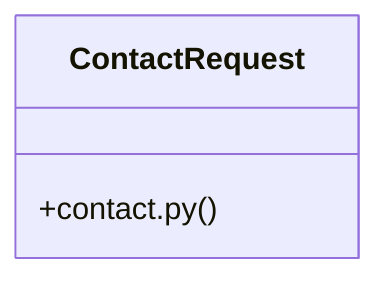

# Community 14

> 24 nodes · cohesion 0.10

## Key Concepts

- [test_email_delivery.py](file:///E:/Non_Office/Dev_Space/vibe_skool/freeOcr/src/tests/test_email_delivery.py#L1) (11 connections)
- [send_download_links_email()](file:///E:/Non_Office/Dev_Space/vibe_skool/freeOcr/src/backend/app/services/email_service.py#L20) (8 connections)
- [submit_contact_form()](file:///E:/Non_Office/Dev_Space/vibe_skool/freeOcr/src/backend/app/api/v1/endpoints/contact.py#L20) (5 connections)
- [validate_email_address()](file:///E:/Non_Office/Dev_Space/vibe_skool/freeOcr/src/backend/app/services/email_service.py#L11) (5 connections)
- [send_contact_inquiry_email()](file:///E:/Non_Office/Dev_Space/vibe_skool/freeOcr/src/backend/app/services/email_service.py#L175) (4 connections)
- [email_service.py](file:///E:/Non_Office/Dev_Space/vibe_skool/freeOcr/src/backend/app/services/email_service.py#L1) (3 connections)
- **BaseModel** (2 connections)
- [ContactRequest](file:///E:/Non_Office/Dev_Space/vibe_skool/freeOcr/src/backend/app/api/v1/endpoints/contact.py#L11) (2 connections)
- [contact.py](file:///E:/Non_Office/Dev_Space/vibe_skool/freeOcr/src/backend/app/api/v1/endpoints/contact.py#L1) (2 connections)
- [test_send_download_links_email_formatting()](file:///E:/Non_Office/Dev_Space/vibe_skool/freeOcr/src/tests/test_email_delivery.py#L22) (2 connections)
- [test_send_download_links_via_resend_api_failure_response()](file:///E:/Non_Office/Dev_Space/vibe_skool/freeOcr/src/tests/test_email_delivery.py#L188) (2 connections)
- [test_send_download_links_via_resend_api_network_exception()](file:///E:/Non_Office/Dev_Space/vibe_skool/freeOcr/src/tests/test_email_delivery.py#L211) (2 connections)
- [test_send_download_links_via_resend_api_success()](file:///E:/Non_Office/Dev_Space/vibe_skool/freeOcr/src/tests/test_email_delivery.py#L149) (2 connections)
- [test_validate_email_address_valid_and_invalid()](file:///E:/Non_Office/Dev_Space/vibe_skool/freeOcr/src/tests/test_email_delivery.py#L14) (2 connections)
- [Submits a contact inquiry. Validates input and logs contact submission.](file:///E:/Non_Office/Dev_Space/vibe_skool/freeOcr/src/backend/app/api/v1/endpoints/contact.py#L21) (1 connections)
- [Validates email format using regex.](file:///E:/Non_Office/Dev_Space/vibe_skool/freeOcr/src/backend/app/services/email_service.py#L12) (1 connections)
- [Dispatches a website contact inquiry to the support inbox (support@freeocr.me).](file:///E:/Non_Office/Dev_Space/vibe_skool/freeOcr/src/backend/app/services/email_service.py#L182) (1 connections)
- [Dispatches 24-hour expiring download links to the target email.     Uses Resend](file:///E:/Non_Office/Dev_Space/vibe_skool/freeOcr/src/backend/app/services/email_service.py#L21) (1 connections)
- [test_api_endpoint_resend_delivery_integration()](file:///E:/Non_Office/Dev_Space/vibe_skool/freeOcr/src/tests/test_email_delivery.py#L229) (1 connections)
- [test_send_email_links_custom_api_base_url_env_var()](file:///E:/Non_Office/Dev_Space/vibe_skool/freeOcr/src/tests/test_email_delivery.py#L120) (1 connections)
- [test_send_email_links_invalid_email_format()](file:///E:/Non_Office/Dev_Space/vibe_skool/freeOcr/src/tests/test_email_delivery.py#L83) (1 connections)
- [test_send_email_links_job_not_completed()](file:///E:/Non_Office/Dev_Space/vibe_skool/freeOcr/src/tests/test_email_delivery.py#L101) (1 connections)
- [test_send_email_links_job_not_found()](file:///E:/Non_Office/Dev_Space/vibe_skool/freeOcr/src/tests/test_email_delivery.py#L92) (1 connections)
- [test_send_email_links_success_and_purges_ram_disk()](file:///E:/Non_Office/Dev_Space/vibe_skool/freeOcr/src/tests/test_email_delivery.py#L38) (1 connections)

## Class Diagram

## Relationships

- [[Community 13]] (4 shared connections)

## Source Files

- [E:\Non_Office\Dev_Space\vibe_skool\freeOcr\src\backend\app\api\v1\endpoints\contact.py](file:///E:/Non_Office/Dev_Space/vibe_skool/freeOcr/src/backend/app/api/v1/endpoints/contact.py)
- [E:\Non_Office\Dev_Space\vibe_skool\freeOcr\src\backend\app\services\email_service.py](file:///E:/Non_Office/Dev_Space/vibe_skool/freeOcr/src/backend/app/services/email_service.py)
- [E:\Non_Office\Dev_Space\vibe_skool\freeOcr\src\tests\test_email_delivery.py](file:///E:/Non_Office/Dev_Space/vibe_skool/freeOcr/src/tests/test_email_delivery.py)

## Audit Trail

- EXTRACTED: 43 (69%)
- INFERRED: 19 (31%)
- AMBIGUOUS: 0 (0%)

---

*Part of the graphify knowledge wiki. See [[index]] to navigate.*