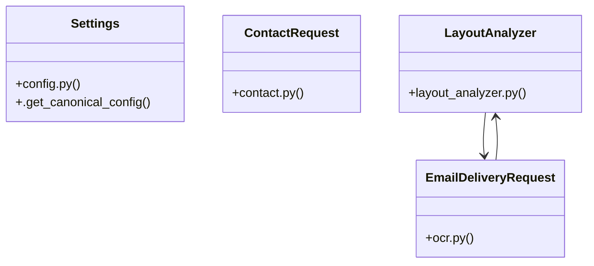

# Community 5

> 61 nodes · cohesion 0.05

## Key Concepts

- [test_email_delivery.py](file:///E:/Non_Office/Dev_Space/vibe_skool/freeOcr/src/tests/test_email_delivery.py#L1) (11 connections)
- [load_canonical_config()](file:///E:/Non_Office/Dev_Space/vibe_skool/freeOcr/src/backend/app/config.py#L10) (9 connections)
- [convert_document()](file:///E:/Non_Office/Dev_Space/vibe_skool/freeOcr/src/backend/app/api/v1/endpoints/ocr.py#L140) (9 connections)
- [send_download_links_email()](file:///E:/Non_Office/Dev_Space/vibe_skool/freeOcr/src/backend/app/services/email_service.py#L20) (8 connections)
- [rewarded_ad_callback()](file:///E:/Non_Office/Dev_Space/vibe_skool/freeOcr/src/backend/app/api/v1/endpoints/ocr.py#L301) (8 connections)
- [ocr.py](file:///E:/Non_Office/Dev_Space/vibe_skool/freeOcr/src/backend/app/api/v1/endpoints/ocr.py#L1) (7 connections)
- [analyze_pdf_bytes()](file:///E:/Non_Office/Dev_Space/vibe_skool/freeOcr/src/backend/app/services/layout_analyzer.py#L14) (7 connections)
- [LayoutAnalyzer](file:///E:/Non_Office/Dev_Space/vibe_skool/freeOcr/src/backend/app/services/layout_analyzer.py#L12) (6 connections)
- [email_download_links()](file:///E:/Non_Office/Dev_Space/vibe_skool/freeOcr/src/backend/app/api/v1/endpoints/ocr.py#L48) (6 connections)
- [submit_contact_form()](file:///E:/Non_Office/Dev_Space/vibe_skool/freeOcr/src/backend/app/api/v1/endpoints/contact.py#L20) (5 connections)
- [test_layout_analyzer.py](file:///E:/Non_Office/Dev_Space/vibe_skool/freeOcr/src/tests/test_layout_analyzer.py#L1) (5 connections)
- [validate_email_address()](file:///E:/Non_Office/Dev_Space/vibe_skool/freeOcr/src/backend/app/services/email_service.py#L11) (5 connections)
- [_get_session_keys()](file:///E:/Non_Office/Dev_Space/vibe_skool/freeOcr/src/backend/app/api/v1/endpoints/ocr.py#L37) (5 connections)
- [config.py](file:///E:/Non_Office/Dev_Space/vibe_skool/freeOcr/src/backend/app/config.py#L1) (4 connections)
- [database.py](file:///E:/Non_Office/Dev_Space/vibe_skool/freeOcr/src/backend/app/database.py#L1) (4 connections)
- [send_contact_inquiry_email()](file:///E:/Non_Office/Dev_Space/vibe_skool/freeOcr/src/backend/app/services/email_service.py#L175) (4 connections)
- [_get_normalized_client_ip()](file:///E:/Non_Office/Dev_Space/vibe_skool/freeOcr/src/backend/app/api/v1/endpoints/ocr.py#L26) (4 connections)
- [get_runtime_config()](file:///E:/Non_Office/Dev_Space/vibe_skool/freeOcr/src/backend/app/api/v1/endpoints/config.py#L9) (3 connections)
- [Settings](file:///E:/Non_Office/Dev_Space/vibe_skool/freeOcr/src/backend/app/config.py#L40) (3 connections)
- [email_service.py](file:///E:/Non_Office/Dev_Space/vibe_skool/freeOcr/src/backend/app/services/email_service.py#L1) (3 connections)
- [layout_analyzer.py](file:///E:/Non_Office/Dev_Space/vibe_skool/freeOcr/src/backend/app/services/layout_analyzer.py#L1) (3 connections)
- [test_config_and_quotas.py](file:///E:/Non_Office/Dev_Space/vibe_skool/freeOcr/src/tests/test_config_and_quotas.py#L1) (3 connections)
- [EmailDeliveryRequest](file:///E:/Non_Office/Dev_Space/vibe_skool/freeOcr/src/backend/app/api/v1/endpoints/ocr.py#L21) (3 connections)
- [create_sample_pdf()](file:///E:/Non_Office/Dev_Space/vibe_skool/freeOcr/src/tests/test_layout_analyzer.py#L6) (3 connections)
- [test_complex_layout_math_formula()](file:///E:/Non_Office/Dev_Space/vibe_skool/freeOcr/src/tests/test_layout_analyzer.py#L23) (3 connections)
- *... and 36 more nodes in this community*

## Class Diagram

## Relationships

- [[Community 11]] (11 shared connections)
- [[Community 14]] (4 shared connections)

## Source Files

- [E:\Non_Office\Dev_Space\vibe_skool\freeOcr\src\backend\app\api\v1\endpoints\config.py](file:///E:/Non_Office/Dev_Space/vibe_skool/freeOcr/src/backend/app/api/v1/endpoints/config.py)
- [E:\Non_Office\Dev_Space\vibe_skool\freeOcr\src\backend\app\api\v1\endpoints\contact.py](file:///E:/Non_Office/Dev_Space/vibe_skool/freeOcr/src/backend/app/api/v1/endpoints/contact.py)
- [E:\Non_Office\Dev_Space\vibe_skool\freeOcr\src\backend\app\api\v1\endpoints\ocr.py](file:///E:/Non_Office/Dev_Space/vibe_skool/freeOcr/src/backend/app/api/v1/endpoints/ocr.py)
- [E:\Non_Office\Dev_Space\vibe_skool\freeOcr\src\backend\app\config.py](file:///E:/Non_Office/Dev_Space/vibe_skool/freeOcr/src/backend/app/config.py)
- [E:\Non_Office\Dev_Space\vibe_skool\freeOcr\src\backend\app\database.py](file:///E:/Non_Office/Dev_Space/vibe_skool/freeOcr/src/backend/app/database.py)
- [E:\Non_Office\Dev_Space\vibe_skool\freeOcr\src\backend\app\services\email_service.py](file:///E:/Non_Office/Dev_Space/vibe_skool/freeOcr/src/backend/app/services/email_service.py)
- [E:\Non_Office\Dev_Space\vibe_skool\freeOcr\src\backend\app\services\layout_analyzer.py](file:///E:/Non_Office/Dev_Space/vibe_skool/freeOcr/src/backend/app/services/layout_analyzer.py)
- [E:\Non_Office\Dev_Space\vibe_skool\freeOcr\src\tests\test_config_and_quotas.py](file:///E:/Non_Office/Dev_Space/vibe_skool/freeOcr/src/tests/test_config_and_quotas.py)
- [E:\Non_Office\Dev_Space\vibe_skool\freeOcr\src\tests\test_email_delivery.py](file:///E:/Non_Office/Dev_Space/vibe_skool/freeOcr/src/tests/test_email_delivery.py)
- [E:\Non_Office\Dev_Space\vibe_skool\freeOcr\src\tests\test_layout_analyzer.py](file:///E:/Non_Office/Dev_Space/vibe_skool/freeOcr/src/tests/test_layout_analyzer.py)

## Audit Trail

- EXTRACTED: 123 (66%)
- INFERRED: 64 (34%)
- AMBIGUOUS: 0 (0%)

---

*Part of the graphify knowledge wiki. See [[index]] to navigate.*