# get_redis_client()

> God node · 20 connections · [E:\Non_Office\Dev_Space\vibe_skool\freeOcr\src\backend\app\redis_client.py](file:///E:/Non_Office/Dev_Space/vibe_skool/freeOcr/src/backend/app/redis_client.py#L89)

## Call Trace Diagram

```mermaid
sequenceDiagram
    participant P0 as get_redis_client()
    participant P1 as compose_searchable_pdf()
    participant P2 as .get()
    participant P3 as process_ocr_job()
    participant P4 as get_searchable_pdf()
    participant P5 as convert_document()
    participant P6 as rewarded_ad_callback()
    participant P7 as send_download_links_email()
    participant P8 as analyze_pdf_bytes()
    participant P9 as get_ad_pass_metadata()
    participant P10 as email_download_links()
    participant P11 as submit_contact_form()
    participant P12 as get_job_page_image()
    participant P13 as batch_download_zip()
    participant P14 as download_job_file()
    participant P15 as _get_session_keys()
    participant P16 as get_baidu_ocr_engine()
    participant P17 as parse_grounding_output()
    participant P18 as purge_ephemeral_ram_disk()
    participant P19 as test_ocr_worker_dispatches_to_baidu_gpu_service()
    participant P20 as test_ocr_worker_corrupted_pdf_repair_integration()
    participant P21 as store_job_metadata()
    participant P22 as get_job_metadata()
    participant P23 as get_job_status()
    participant P24 as stream_job_events()
    participant P25 as get_job_preview()
    participant P26 as _get_normalized_client_ip()
    participant P27 as send_contact_inquiry_email()
    participant P28 as test_page_image_valid_completed_job_returns_png()
    participant P29 as test_page_image_out_of_range_page_returns_404()
    participant P30 as test_process_ocr_job_ephemeral_file_cleanup_on_exception()
    participant P31 as test_ephemeral_file_cleanup_pdf_composer()
    participant P32 as test_get_searchable_pdf_from_redis_when_local_cache_misses()
    participant P33 as test_ocr_worker_decryption_process()
    participant P34 as verify_internal_secret()
    participant P35 as test_adsense_config_api_endpoint()
    participant P36 as test_dynamic_config_file_reload()
    participant P37 as test_baidu_gpu_service_health()
    participant P38 as test_download_invalid_format_returns_400()
    participant P39 as test_download_non_existent_job_returns_410_gone()
    participant P40 as test_download_pdf_success_and_purges_ram_disk()
    participant P41 as test_download_txt_success()
    participant P42 as test_download_md_success()
    participant P43 as test_batch_download_zip_success()
    participant P44 as test_batch_download_zip_invalid_format()
    participant P45 as test_download_all_formats_from_redis_on_cold_boot()
    participant P46 as test_download_zip_single_job_success()
    participant P47 as test_healthz_endpoint_healthy()
    participant P48 as test_healthz_endpoint_unhealthy_redis()
    participant P49 as test_healthz_endpoint_unhealthy_database()
    participant P50 as test_page_image_non_existent_job_returns_404_or_410()
    participant P51 as test_page_image_zero_or_negative_page_returns_422_or_400()
    participant P52 as test_get_config_limits_endpoint()
    participant P53 as test_dynamic_limit_config_reload()
    participant P54 as test_download_expired_job_returns_410_gone()
    participant P55 as test_download_non_existent_job_returns_410_gone()
    participant P56 as test_preview_non_existent_job_returns_410_gone()
    participant P57 as test_preview_completed_job_returns_pages_data()
    participant P58 as test_convert_endpoint_triggers_background_ocr_worker()
    participant P59 as test_encrypted_pdf_rejected_without_password()
    participant P60 as test_encrypted_pdf_rejected_with_invalid_password()
    participant P61 as test_encrypted_pdf_accepted_with_correct_password()
    participant P62 as .__init__()
    participant P63 as test_get_config_endpoint()
    participant P64 as test_health_check()
    participant P65 as test_sse_endpoint_returns_event_stream_headers()
    participant P66 as test_sse_stream_emits_page_progress_and_completed_events()
    participant P67 as test_sse_stream_emits_failed_event()
    participant P68 as test_sse_endpoint_non_existent_job_returns_404()
    participant P69 as test_sse_endpoint_non_existent_job_returns_404()
    participant P70 as test_sse_endpoint_streams_redis_events()
    participant P71 as test_get_searchable_pdf_retrieval()
    participant P72 as test_complex_two_column_pdf_reconstruction()
    participant P73 as test_word_level_highlight_alignment_and_space_distribution()
    participant P74 as test_compose_searchable_pdf_from_pdf()
    participant P75 as test_compose_searchable_pdf_from_image()
    participant P76 as test_compose_searchable_pdf_with_rotation_and_morph_scaling()
    participant P77 as check_redis_connection()
    participant P78 as store_ad_pass_metadata()
    participant P79 as _publish_event()
    participant P80 as _store_job()
    participant P81 as test_redis_client_configuration()
    P0->>+ P1: calls
    P1-->>- P0: return
    P1->>+ P2: calls
    P2-->>- P1: return
    P2->>+ P3: calls
    P3-->>- P2: return
    P2->>+ P1: calls
    P1-->>- P2: return
    P2->>+ P4: calls
    P4-->>- P2: return
    P2->>+ P5: calls
    P5-->>- P2: return
    P2->>+ P6: calls
    P6-->>- P2: return
    P2->>+ P7: calls
    P7-->>- P2: return
    P2->>+ P8: calls
    P8-->>- P2: return
    P2->>+ P9: calls
    P9-->>- P2: return
    P2->>+ P10: calls
    P10-->>- P2: return
    P2->>+ P11: calls
    P11-->>- P2: return
    P2->>+ P12: calls
    P12-->>- P2: return
    P2->>+ P13: calls
    P13-->>- P2: return
    P2->>+ P14: calls
    P14-->>- P2: return
    P2->>+ P15: calls
    P15-->>- P2: return
    P2->>+ P16: calls
    P16-->>- P2: return
    P2->>+ P17: calls
    P17-->>- P2: return
    P2->>+ P18: calls
    P18-->>- P2: return
    P2->>+ P19: calls
    P19-->>- P2: return
    P2->>+ P20: calls
    P20-->>- P2: return
    P2->>+ P21: calls
    P21-->>- P2: return
    P2->>+ P22: calls
    P22-->>- P2: return
    P2->>+ P23: calls
    P23-->>- P2: return
    P2->>+ P24: calls
    P24-->>- P2: return
    P2->>+ P25: calls
    P25-->>- P2: return
    P2->>+ P26: calls
    P26-->>- P2: return
    P2->>+ P27: calls
    P27-->>- P2: return
    P2->>+ P28: calls
    P28-->>- P2: return
    P2->>+ P29: calls
    P29-->>- P2: return
    P2->>+ P30: calls
    P30-->>- P2: return
    P2->>+ P31: calls
    P31-->>- P2: return
    P2->>+ P32: calls
    P32-->>- P2: return
    P2->>+ P33: calls
    P33-->>- P2: return
    P2->>+ P34: calls
    P34-->>- P2: return
    P2->>+ P35: calls
    P35-->>- P2: return
    P2->>+ P36: calls
    P36-->>- P2: return
    P2->>+ P37: calls
    P37-->>- P2: return
    P2->>+ P38: calls
    P38-->>- P2: return
    P2->>+ P39: calls
    P39-->>- P2: return
    P2->>+ P40: calls
    P40-->>- P2: return
    P2->>+ P41: calls
    P41-->>- P2: return
    P2->>+ P42: calls
    P42-->>- P2: return
    P2->>+ P43: calls
    P43-->>- P2: return
    P2->>+ P44: calls
    P44-->>- P2: return
    P2->>+ P45: calls
    P45-->>- P2: return
    P2->>+ P46: calls
    P46-->>- P2: return
    P2->>+ P47: calls
    P47-->>- P2: return
    P2->>+ P48: calls
    P48-->>- P2: return
    P2->>+ P49: calls
    P49-->>- P2: return
    P2->>+ P50: calls
    P50-->>- P2: return
    P2->>+ P51: calls
    P51-->>- P2: return
    P2->>+ P52: calls
    P52-->>- P2: return
    P2->>+ P53: calls
    P53-->>- P2: return
    P2->>+ P54: calls
    P54-->>- P2: return
    P2->>+ P55: calls
    P55-->>- P2: return
    P2->>+ P56: calls
    P56-->>- P2: return
    P2->>+ P57: calls
    P57-->>- P2: return
    P2->>+ P58: calls
    P58-->>- P2: return
    P2->>+ P59: calls
    P59-->>- P2: return
    P2->>+ P60: calls
    P60-->>- P2: return
    P2->>+ P61: calls
    P61-->>- P2: return
    P2->>+ P62: calls
    P62-->>- P2: return
    P2->>+ P63: calls
    P63-->>- P2: return
    P2->>+ P64: calls
    P64-->>- P2: return
    P2->>+ P65: calls
    P65-->>- P2: return
    P2->>+ P66: calls
    P66-->>- P2: return
    P2->>+ P67: calls
    P67-->>- P2: return
    P2->>+ P68: calls
    P68-->>- P2: return
    P2->>+ P69: calls
    P69-->>- P2: return
    P2->>+ P70: calls
    P70-->>- P2: return
    P1->>+ P0: calls
    P0-->>- P1: return
    P1->>+ P3: calls
    P3-->>- P1: return
    P1->>+ P71: calls
    P71-->>- P1: return
    P1->>+ P31: calls
    P31-->>- P1: return
    P1->>+ P72: calls
    P72-->>- P1: return
    P1->>+ P73: calls
    P73-->>- P1: return
    P1->>+ P74: calls
    P74-->>- P1: return
    P1->>+ P75: calls
    P75-->>- P1: return
    P1->>+ P76: calls
    P76-->>- P1: return
    P0->>+ P4: calls
    P4-->>- P0: return
    P0->>+ P5: calls
    P5-->>- P0: return
    P0->>+ P6: calls
    P6-->>- P0: return
    P0->>+ P9: calls
    P9-->>- P0: return
    P0->>+ P10: calls
    P10-->>- P0: return
    P0->>+ P77: calls
    P77-->>- P0: return
    P0->>+ P12: calls
    P12-->>- P0: return
    P0->>+ P13: calls
    P13-->>- P0: return
    P0->>+ P14: calls
    P14-->>- P0: return
    P0->>+ P21: calls
    P21-->>- P0: return
    P0->>+ P22: calls
    P22-->>- P0: return
    P0->>+ P78: calls
    P78-->>- P0: return
    P0->>+ P23: calls
    P23-->>- P0: return
    P0->>+ P24: calls
    P24-->>- P0: return
    P0->>+ P25: calls
    P25-->>- P0: return
    P0->>+ P79: calls
    P79-->>- P0: return
    P0->>+ P80: calls
    P80-->>- P0: return
    P0->>+ P81: calls
    P81-->>- P0: return
```

## Connections by Relation

### calls
- [[compose_searchable_pdf()]] `INFERRED`
- [[get_searchable_pdf()]] `INFERRED`
- [[convert_document()]] `INFERRED`
- [[rewarded_ad_callback()]] `INFERRED`
- [[get_ad_pass_metadata()]] `EXTRACTED`
- [[email_download_links()]] `INFERRED`
- [[check_redis_connection()]] `EXTRACTED`
- [[get_job_page_image()]] `INFERRED`
- [[batch_download_zip()]] `INFERRED`
- [[download_job_file()]] `INFERRED`
- [[store_job_metadata()]] `EXTRACTED`
- [[get_job_metadata()]] `EXTRACTED`
- [[store_ad_pass_metadata()]] `EXTRACTED`
- [[get_job_status()]] `INFERRED`
- [[stream_job_events()]] `INFERRED`
- [[get_job_preview()]] `INFERRED`
- [[_publish_event()]] `INFERRED`
- [[_store_job()]] `INFERRED`
- [[test_redis_client_configuration()]] `INFERRED`

### contains
- [[redis_client.py]] `EXTRACTED`

---

*Part of the graphify knowledge wiki. See [[index]] to navigate.*