# Knowledge Graph Index

> Auto-generated by graphify. Start here — read community articles for context, then drill into god nodes for detail.

**1011 nodes · 1321 edges · 45 communities**

---

## System Architecture Flowchart

```mermaid
flowchart TD
    C0["Community 0 (124 nodes)"]
    C1["Community 1 (107 nodes)"]
    C2["Community 2 (89 nodes)"]
    C3["Community 3 (68 nodes)"]
    C4["Community 4 (65 nodes)"]
    C5["Community 5 (61 nodes)"]
    C6["Community 6 (57 nodes)"]
    C7["Community 7 (54 nodes)"]
    C8["Community 8 (52 nodes)"]
    C9["Community 9 (44 nodes)"]
    C10["Community 10 (42 nodes)"]
    C11["Community 11 (40 nodes)"]
    C12["Community 12 (30 nodes)"]
    C13["Community 13 (29 nodes)"]
    C14["Community 14 (26 nodes)"]
    C15["Community 15 (17 nodes)"]
    C16["Community 16 (13 nodes)"]
    C17["Community 17 (9 nodes)"]
    C18["Community 18 (8 nodes)"]
    C19["Community 19 (8 nodes)"]
    C20["Community 20 (8 nodes)"]
    C21["Community 21 (7 nodes)"]
    C22["Community 22 (7 nodes)"]
    C23["Community 23 (5 nodes)"]
    C24["unknown (5 nodes)"]
    C25["unknown (5 nodes)"]
    C26["Community 26 (4 nodes)"]
    C27["Community 27 (3 nodes)"]
    C28["Community 28 (3 nodes)"]
    C29["Community 29 (3 nodes)"]
    C30["Community 30 (3 nodes)"]
    C31["Community 31 (2 nodes)"]
    C32["unknown (1 nodes)"]
    C33["unknown (1 nodes)"]
    C34["unknown (1 nodes)"]
    C35["unknown (1 nodes)"]
    C36["Community 36 (1 nodes)"]
    C37["unknown (1 nodes)"]
    C38["unknown (1 nodes)"]
    C39["unknown (1 nodes)"]
    C40["Community 40 (1 nodes)"]
    C41["Community 41 (1 nodes)"]
    C42["Community 42 (1 nodes)"]
    C43["Community 43 (1 nodes)"]
    C44["Community 44 (1 nodes)"]
    C2 -->|13 edges| C4
    C1 -->|11 edges| C3
    C2 -->|10 edges| C5
    C0 -->|8 edges| C1
    C4 -->|6 edges| C5
    C1 -->|6 edges| C6
    C2 -->|5 edges| C12
    C2 -->|5 edges| C9
    C1 -->|5 edges| C14
    C10 -->|4 edges| C1
    C10 -->|3 edges| C7
    C7 -->|3 edges| C11
    C7 -->|3 edges| C3
    C7 -->|3 edges| C8
    C0 -->|3 edges| C6
    C0 -->|3 edges| C3
    C0 -->|3 edges| C7
    C7 -->|3 edges| C1
    C3 -->|3 edges| C11
    C5 -->|2 edges| C4
    C5 -->|2 edges| C2
    C4 -->|2 edges| C2
    C4 -->|2 edges| C9
    C9 -->|2 edges| C4
    C9 -->|2 edges| C12
    C11 -->|2 edges| C3
    C11 -->|2 edges| C0
    C11 -->|2 edges| C7
    C3 -->|2 edges| C13
    C11 -->|2 edges| C8
    C5 -->|1 edges| C8
    C8 -->|1 edges| C4
    C4 -->|1 edges| C12
    C4 -->|1 edges| C22
    C2 -->|1 edges| C16
    C9 -->|1 edges| C2
    C10 -->|1 edges| C0
    C10 -->|1 edges| C13
    C7 -->|1 edges| C6
    C0 -->|1 edges| C14
    C0 -->|1 edges| C11
    C0 -->|1 edges| C19
    C0 -->|1 edges| C15
    C0 -->|1 edges| C13
    C0 -->|1 edges| C20
    C0 -->|1 edges| C8
    C7 -->|1 edges| C13
    C1 -->|1 edges| C13
    C1 -->|1 edges| C8
    C6 -->|1 edges| C1
    C6 -->|1 edges| C7
    C14 -->|1 edges| C6
    C11 -->|1 edges| C1
    C3 -->|1 edges| C8
    C11 -->|1 edges| C13
```

## Communities
(sorted by size, largest first)

- [[Community 0]] — 124 nodes
- [[Community 1]] — 107 nodes
- [[Community 2]] — 89 nodes
- [[Community 3]] — 68 nodes
- [[Community 4]] — 65 nodes
- [[Community 5]] — 61 nodes
- [[Community 6]] — 57 nodes
- [[Community 7]] — 54 nodes
- [[Community 8]] — 52 nodes
- [[Community 9]] — 44 nodes
- [[Community 10]] — 42 nodes
- [[Community 11]] — 40 nodes
- [[Community 12]] — 30 nodes
- [[Community 13]] — 29 nodes
- [[Community 14]] — 26 nodes
- [[Community 15]] — 17 nodes
- [[Community 16]] — 13 nodes
- [[Community 17]] — 9 nodes
- [[Community 18]] — 8 nodes
- [[Community 19]] — 8 nodes
- [[Community 20]] — 8 nodes
- [[Community 21]] — 7 nodes
- [[Community 22]] — 7 nodes
- [[Community 23]] — 5 nodes
- [[unknown]] — 5 nodes
- [[unknown]] — 5 nodes
- [[Community 26]] — 4 nodes
- [[Community 27]] — 3 nodes
- [[Community 28]] — 3 nodes
- [[Community 29]] — 3 nodes
- [[Community 30]] — 3 nodes
- [[Community 31]] — 2 nodes
- [[unknown]] — 1 nodes
- [[unknown]] — 1 nodes
- [[unknown]] — 1 nodes
- [[unknown]] — 1 nodes
- [[Community 36]] — 1 nodes
- [[unknown]] — 1 nodes
- [[unknown]] — 1 nodes
- [[unknown]] — 1 nodes
- [[Community 40]] — 1 nodes
- [[Community 41]] — 1 nodes
- [[Community 42]] — 1 nodes
- [[Community 43]] — 1 nodes
- [[Community 44]] — 1 nodes

## God Nodes
(most connected concepts — the load-bearing abstractions)

- [[package:flutter/material.dart]] — 49 connections
- [[get_redis_client()]] — 20 connections
- [[package:flutter_test/flutter_test.dart]] — 20 connections
- [[EphemeralRamStore]] — 19 connections
- [[process_ocr_job()]] — 19 connections
- [[../services/telemetry_service.dart]] — 16 connections
- [[package:flutter/foundation.dart]] — 13 connections
- [[../widgets/adsense_banner.dart]] — 13 connections
- [[../widgets/app_header.dart]] — 13 connections
- [[../widgets/app_footer.dart]] — 13 connections

---

*Generated by [graphify](https://github.com/safishamsi/graphify)*