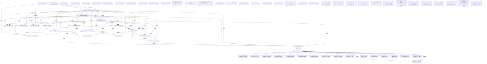

# Knowledge Graph Index

> Auto-generated by graphify. Start here — read community articles for context, then drill into god nodes for detail.

**1992 nodes · 2775 edges · 73 communities**

---

## System Architecture Flowchart

```mermaid
flowchart TD
    C0["Community 0 (255 nodes)"]
    C1["Community 1 (215 nodes)"]
    C2["Community 2 (207 nodes)"]
    C3["Community 3 (121 nodes)"]
    C4["Community 4 (66 nodes)"]
    C5["Community 5 (64 nodes)"]
    C6["Community 6 (58 nodes)"]
    C7["Community 7 (48 nodes)"]
    C8["Community 8 (47 nodes)"]
    C9["Community 9 (46 nodes)"]
    C10["Community 10 (44 nodes)"]
    C11["Community 11 (40 nodes)"]
    C12["Community 12 (40 nodes)"]
    C13["Community 13 (37 nodes)"]
    C14["Community 14 (37 nodes)"]
    C15["Community 15 (36 nodes)"]
    C16["Community 16 (34 nodes)"]
    C17["Community 17 (33 nodes)"]
    C18["Community 18 (33 nodes)"]
    C19["Community 19 (31 nodes)"]
    C20["Community 20 (31 nodes)"]
    C21["Community 21 (31 nodes)"]
    C22["Community 22 (31 nodes)"]
    C23["Community 23 (31 nodes)"]
    C24["unknown (30 nodes)"]
    C25["unknown (30 nodes)"]
    C26["Community 26 (29 nodes)"]
    C27["Community 27 (29 nodes)"]
    C28["Community 28 (29 nodes)"]
    C29["Community 29 (27 nodes)"]
    C30["Community 30 (26 nodes)"]
    C31["Community 31 (16 nodes)"]
    C32["unknown (13 nodes)"]
    C33["unknown (13 nodes)"]
    C34["unknown (13 nodes)"]
    C35["unknown (12 nodes)"]
    C36["Community 36 (11 nodes)"]
    C37["unknown (9 nodes)"]
    C38["unknown (8 nodes)"]
    C39["unknown (7 nodes)"]
    C40["Community 40 (7 nodes)"]
    C41["Community 41 (7 nodes)"]
    C42["Community 42 (5 nodes)"]
    C43["Community 43 (5 nodes)"]
    C44["Community 44 (5 nodes)"]
    C45["Community 45 (4 nodes)"]
    C46["Community 46 (4 nodes)"]
    C47["Community 47 (3 nodes)"]
    C48["triggerDownload & triggerDownloadBytes (3 nodes)"]
    C49["navigateToPath & openUrl (3 nodes)"]
    C50["configureAppUrlStrategy & package:flutter_web_plugins/url_strategy.dart (3 nodes)"]
    C51["Community 51 (3 nodes)"]
    C52["configureAppUrlStrategy (2 nodes)"]
    C53["Community 53 (1 nodes)"]
    C54["Community 54 (1 nodes)"]
    C55["Community 55 (1 nodes)"]
    C56["Community 56 (1 nodes)"]
    C57["Inspects PDF layout structure and returns complexity classification. (1 nodes)"]
    C58["Community 58 (1 nodes)"]
    C59["Community 59 (1 nodes)"]
    C60["Stores job payload in Redis, with fallback to in-memory store when Redis is unav (1 nodes)"]
    C61["Retrieves job payload string from Redis, falling back to in-memory store. (1 nodes)"]
    C62["Stores ad pass payload in Redis, with fallback to in-memory store when Redis is (1 nodes)"]
    C63["Retrieves ad pass payload dict from Redis, falling back to in-memory store. (1 nodes)"]
    C64["Verify Redis client initialization with expected configuration. (1 nodes)"]
    C65["Verify check_redis_connection returns True when Redis ping succeeds. (1 nodes)"]
    C66["Verify check_redis_connection returns False gracefully on connection exception. (1 nodes)"]
    C67["Verify downloading zip format for a single job packages PDF, TXT, and MD into an (1 nodes)"]
    C68["Runs inference on 300 DPI page image bytes using authentic Baidu Unlimited OCR. (1 nodes)"]
    C69["Health check verifying microservice readiness, engine name, and GPU status. (1 nodes)"]
    C70["Executes Baidu Unlimited OCR model inference on a 300 DPI complex document page. (1 nodes)"]
    C71["Guarantees tessdata/eng.traineddata availability for fast 1-second Tesseract OCR (1 nodes)"]
    C72["Executes page-by-page OCR extraction on uploaded PDF or image file bytes.     S (1 nodes)"]
    C2 -->|28 edges| C0
    C0 -->|27 edges| C3
    C1 -->|14 edges| C4
    C2 -->|11 edges| C3
    C0 -->|10 edges| C30
    C0 -->|8 edges| C24
    C5 -->|7 edges| C0
    C0 -->|7 edges| C23
    C0 -->|7 edges| C25
    C0 -->|7 edges| C10
    C0 -->|7 edges| C11
    C1 -->|6 edges| C13
    C0 -->|6 edges| C15
    C0 -->|6 edges| C8
    C0 -->|6 edges| C27
    C0 -->|6 edges| C16
    C1 -->|5 edges| C17
    C1 -->|5 edges| C20
    C0 -->|5 edges| C9
    C0 -->|5 edges| C7
    C1 -->|4 edges| C18
    C3 -->|4 edges| C27
    C3 -->|4 edges| C30
    C3 -->|4 edges| C16
    C1 -->|3 edges| C19
    C1 -->|3 edges| C14
    C1 -->|3 edges| C31
    C1 -->|3 edges| C33
    C2 -->|3 edges| C11
    C2 -->|3 edges| C10
    C2 -->|3 edges| C8
    C2 -->|3 edges| C9
    C3 -->|3 edges| C23
    C3 -->|3 edges| C25
    C3 -->|3 edges| C10
    C3 -->|3 edges| C24
    C3 -->|3 edges| C28
    C3 -->|3 edges| C6
    C3 -->|3 edges| C12
    C6 -->|2 edges| C1
    C1 -->|2 edges| C29
    C1 -->|2 edges| C21
    C1 -->|2 edges| C22
    C1 -->|2 edges| C37
    C1 -->|2 edges| C41
    C4 -->|2 edges| C1
    C0 -->|2 edges| C2
    C0 -->|2 edges| C6
    C2 -->|2 edges| C23
    C2 -->|2 edges| C27
    C2 -->|2 edges| C30
    C2 -->|2 edges| C16
    C2 -->|2 edges| C25
    C2 -->|2 edges| C7
    C2 -->|2 edges| C24
    C3 -->|2 edges| C0
    C3 -->|2 edges| C9
    C3 -->|2 edges| C8
    C1 -->|1 edges| C6
    C1 -->|1 edges| C39
    C1 -->|1 edges| C26
    C1 -->|1 edges| C34
    C31 -->|1 edges| C4
    C37 -->|1 edges| C1
    C5 -->|1 edges| C2
    C5 -->|1 edges| C3
    C5 -->|1 edges| C7
    C5 -->|1 edges| C28
    C0 -->|1 edges| C12
    C2 -->|1 edges| C15
    C2 -->|1 edges| C28
    C2 -->|1 edges| C12
    C2 -->|1 edges| C6
    C3 -->|1 edges| C11
    C0 -->|1 edges| C28
    C11 -->|1 edges| C15
    C11 -->|1 edges| C8
    C11 -->|1 edges| C9
    C23 -->|1 edges| C12
    C12 -->|1 edges| C25
    C12 -->|1 edges| C10
    C12 -->|1 edges| C24
    C12 -->|1 edges| C7
    C10 -->|1 edges| C3
    C10 -->|1 edges| C8
    C8 -->|1 edges| C6
    C12 -->|1 edges| C6
    C9 -->|1 edges| C8
```

## Communities
(sorted by size, largest first)

- [[Community 0]] — 255 nodes
- [[Community 1]] — 215 nodes
- [[Community 2]] — 207 nodes
- [[Community 3]] — 121 nodes
- [[Community 4]] — 66 nodes
- [[Community 5]] — 64 nodes
- [[Community 6]] — 58 nodes
- [[Community 7]] — 48 nodes
- [[Community 8]] — 47 nodes
- [[Community 9]] — 46 nodes
- [[Community 10]] — 44 nodes
- [[Community 11]] — 40 nodes
- [[Community 12]] — 40 nodes
- [[Community 13]] — 37 nodes
- [[Community 14]] — 37 nodes
- [[Community 15]] — 36 nodes
- [[Community 16]] — 34 nodes
- [[Community 17]] — 33 nodes
- [[Community 18]] — 33 nodes
- [[Community 19]] — 31 nodes
- [[Community 20]] — 31 nodes
- [[Community 21]] — 31 nodes
- [[Community 22]] — 31 nodes
- [[Community 23]] — 31 nodes
- [[unknown]] — 30 nodes
- [[unknown]] — 30 nodes
- [[Community 26]] — 29 nodes
- [[Community 27]] — 29 nodes
- [[Community 28]] — 29 nodes
- [[Community 29]] — 27 nodes
- [[Community 30]] — 26 nodes
- [[Community 31]] — 16 nodes
- [[unknown]] — 13 nodes
- [[unknown]] — 13 nodes
- [[unknown]] — 13 nodes
- [[unknown]] — 12 nodes
- [[Community 36]] — 11 nodes
- [[unknown]] — 9 nodes
- [[unknown]] — 8 nodes
- [[unknown]] — 7 nodes
- [[Community 40]] — 7 nodes
- [[Community 41]] — 7 nodes
- [[Community 42]] — 5 nodes
- [[Community 43]] — 5 nodes
- [[Community 44]] — 5 nodes
- [[Community 45]] — 4 nodes
- [[Community 46]] — 4 nodes
- [[Community 47]] — 3 nodes
- [[triggerDownload & triggerDownloadBytes]] — 3 nodes
- [[navigateToPath & openUrl]] — 3 nodes
- [[configureAppUrlStrategy & package:flutter_web_plugins/url_strategy.dart]] — 3 nodes
- [[Community 51]] — 3 nodes
- [[configureAppUrlStrategy]] — 2 nodes
- [[Community 53]] — 1 nodes
- [[Community 54]] — 1 nodes
- [[Community 55]] — 1 nodes
- [[Community 56]] — 1 nodes
- [[Inspects PDF layout structure and returns complexity classification.]] — 1 nodes
- [[Community 58]] — 1 nodes
- [[Community 59]] — 1 nodes
- [[Stores job payload in Redis, with fallback to in-memory store when Redis is unav]] — 1 nodes
- [[Retrieves job payload string from Redis, falling back to in-memory store.]] — 1 nodes
- [[Stores ad pass payload in Redis, with fallback to in-memory store when Redis is]] — 1 nodes
- [[Retrieves ad pass payload dict from Redis, falling back to in-memory store.]] — 1 nodes
- [[Verify Redis client initialization with expected configuration.]] — 1 nodes
- [[Verify check_redis_connection returns True when Redis ping succeeds.]] — 1 nodes
- [[Verify check_redis_connection returns False gracefully on connection exception.]] — 1 nodes
- [[Verify downloading zip format for a single job packages PDF, TXT, and MD into an]] — 1 nodes
- [[Runs inference on 300 DPI page image bytes using authentic Baidu Unlimited OCR.]] — 1 nodes
- [[Health check verifying microservice readiness, engine name, and GPU status.]] — 1 nodes
- [[Executes Baidu Unlimited OCR model inference on a 300 DPI complex document page.]] — 1 nodes
- [[Guarantees tessdata/eng.traineddata availability for fast 1-second Tesseract OCR]] — 1 nodes
- [[Executes page-by-page OCR extraction on uploaded PDF or image file bytes.     S]] — 1 nodes

## God Nodes
(most connected concepts — the load-bearing abstractions)

- [[package:flutter/material.dart]] — 82 connections
- [[dart:typed_data]] — 37 connections
- [[../services/telemetry_service.dart]] — 36 connections
- [[../widgets/adsense_banner.dart]] — 32 connections
- [[../widgets/app_header.dart]] — 32 connections
- [[../widgets/app_footer.dart]] — 32 connections
- [[package:flutter_test/flutter_test.dart]] — 32 connections
- [[package:flutter/foundation.dart]] — 30 connections
- [[EphemeralRamStore]] — 28 connections
- [[get_redis_client()]] — 24 connections

---

*Generated by [graphify](https://github.com/safishamsi/graphify)*